# 2. Arm Assembly-

## Tools for this section

<figure><figcaption>
Tools.
</figcaption></figure>

* 5.5 mm hex nut wrench or driver
* 2.5 mm hex screwdriver

## Parts for this section

<figure><figcaption></figcaption></figure>

#### Parts:

* (4x) Arm Tubes
* (4x) Motor Mount
* (4x) Motor Thrust Plate

#### Fasteners:

* (8x) M3x30mm Socket Head Cap Screws
* (8x) M3 Nylon Lock Nut

## Step 1: Aligning Motor Mount

<figure><figcaption>
Aligning hole side of Arm Tube to Motor Mount.
</figcaption></figure>

 

<figure>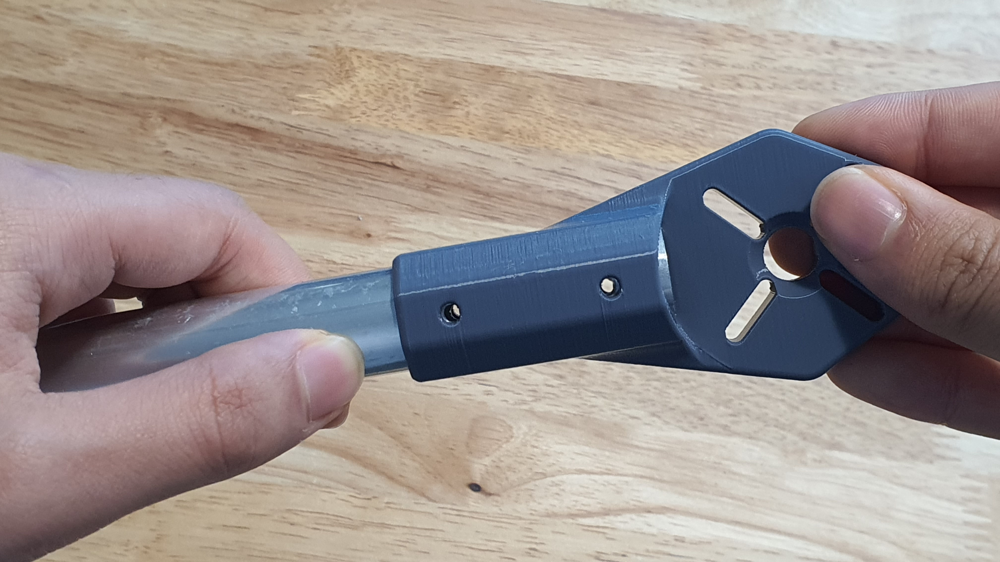<figcaption>
Motor Mount and Arm Tube holes aligned.
</figcaption></figure>

* Prepare an (1x) Arm Tube and (1x) Motor Mount.
* Insert the Motor Mount into the Arm Tube side with the drilled holes.
* Rotate the Motor Mount until the mount holes are aligned with the tube holes underneath.
* When aligned, light should be visible through the holes.

## Step 2: Fastening Motor Mount

<figure>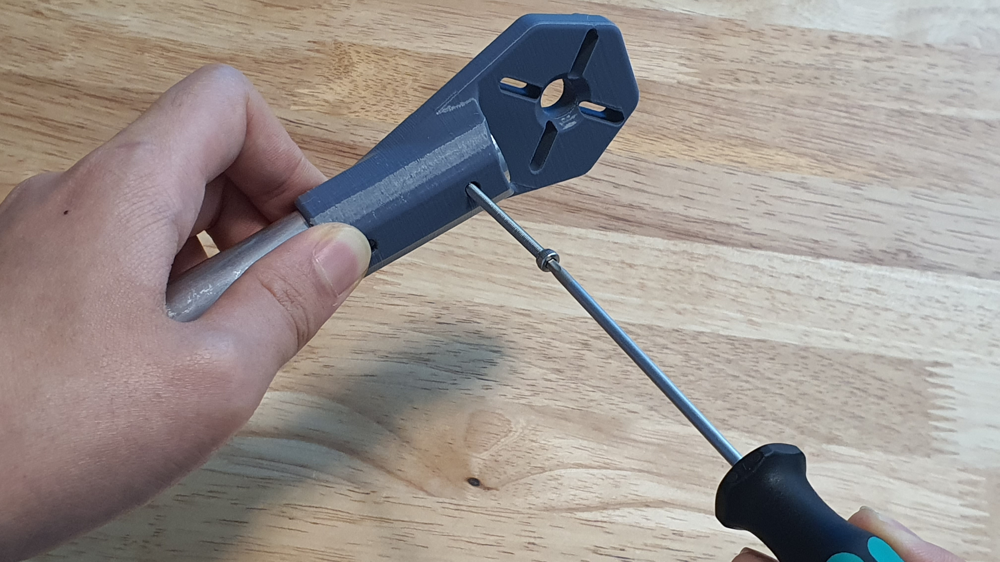<figcaption>
Screwing into the first hole from the top.
</figcaption></figure>

 

<figure>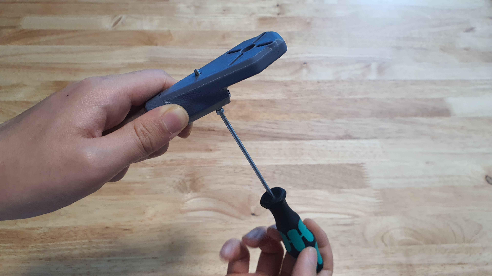<figcaption>
Screw exiting out the bottom.
</figcaption></figure>

* Prepare the (2x) M3x30mm Socket Head Cap Screws and a 2.5 mm hex screwdriver.
* Screw the fastener into the first hole.
* Ensure the screw is properly aligned and exits out the bottom hole.

<figure>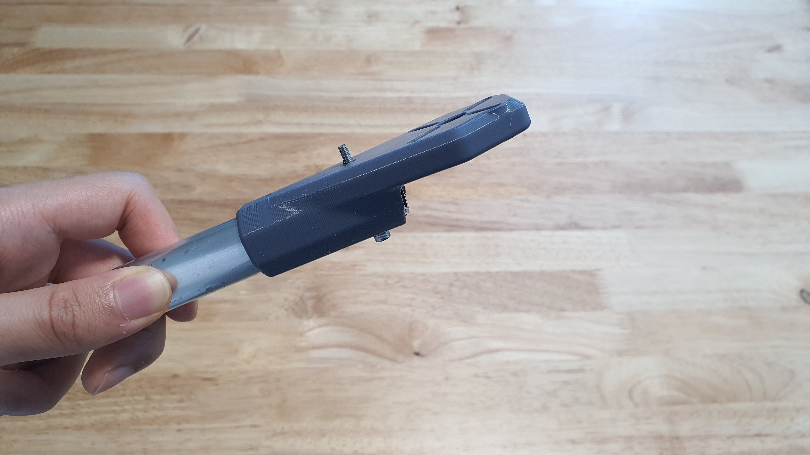<figcaption>
Properly aligned screw.
</figcaption></figure>


Ensure the screw is properly aligned and exits out the bottom hole of the motor mount.


<figure>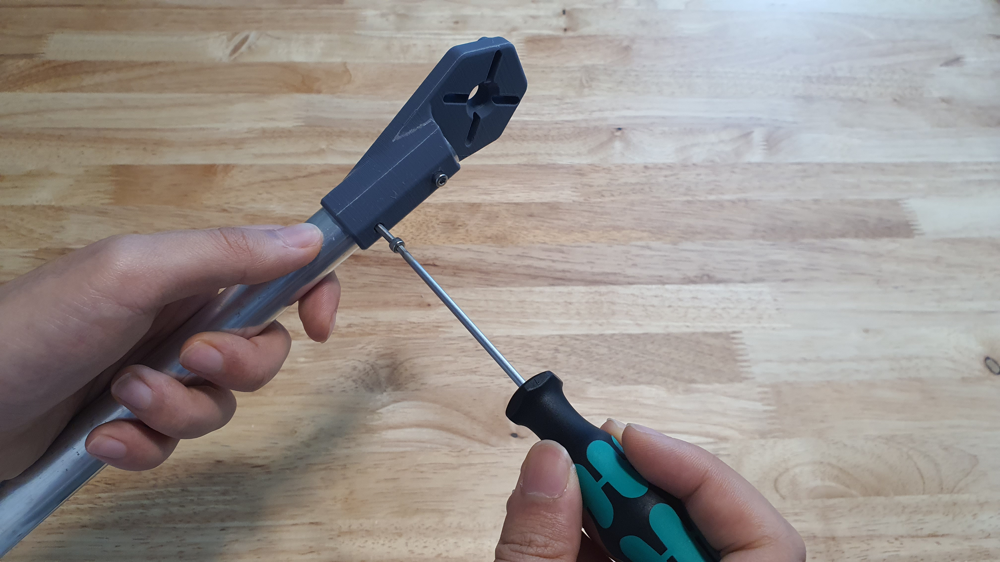<figcaption>
Screwing into the second hole from the top.
</figcaption></figure>

 

<figure>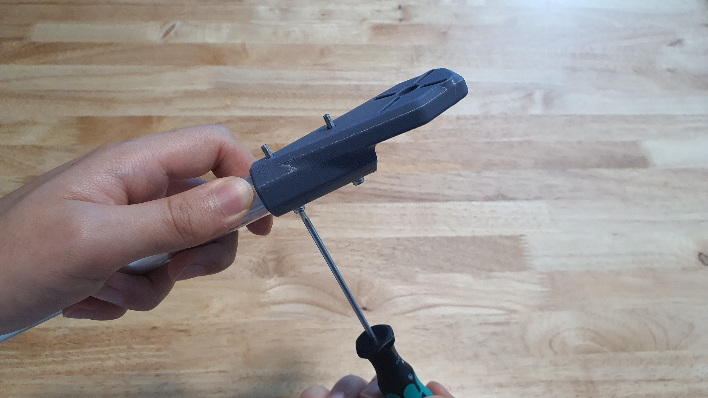<figcaption>
Screw exiting out the bottom.
</figcaption></figure>

* Repeat this process for the second hole.

## Step 3: Aligning Thrust Plate

<figure>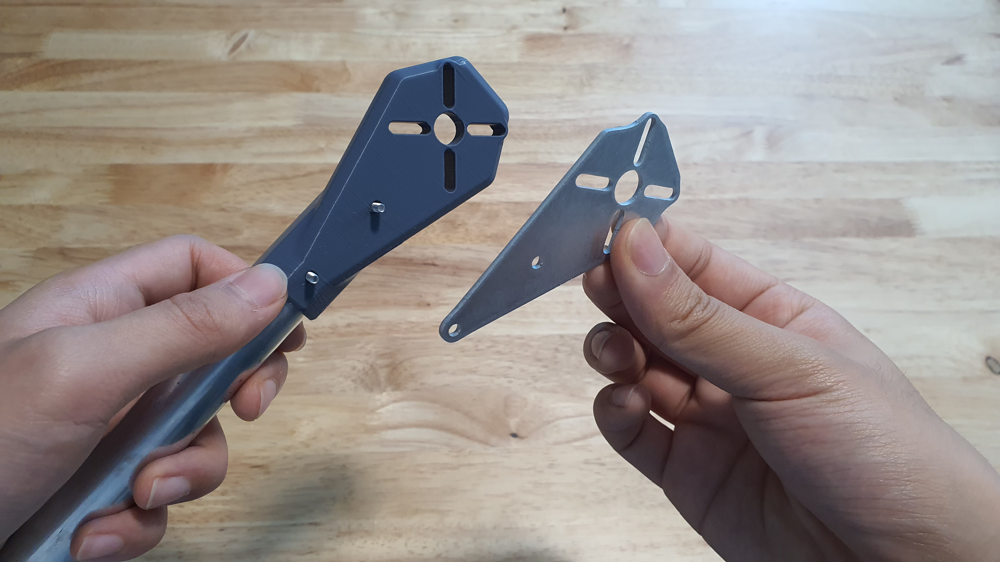<figcaption>
Aligning Thrust Plate to the two screws.
</figcaption></figure>

 

<figure>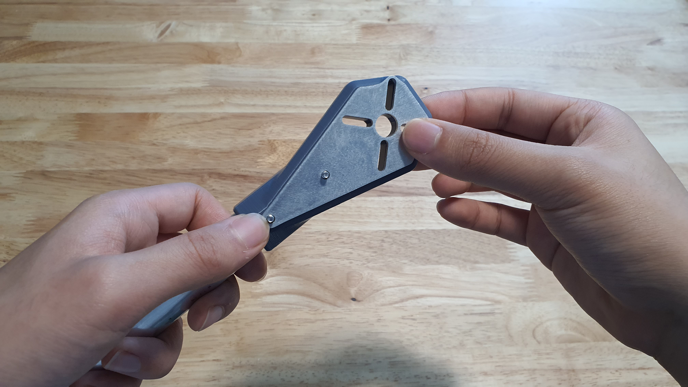<figcaption>
Aligned Thrust Plate flush with Motor Mount.
</figcaption></figure>

* Prepare the Thrust Plate.
* Turn the Motor Mount until the bottom is facing up.
* Locate the two screw ends and align the holes on the Thrust Plate to the two screw ends.
* Ensure the Thrust Plate is flush against the motor mount.

## Step 4: Fastening Thrust Plate

<figure><figcaption>
Aligning nut to the first screw end.
</figcaption></figure>

 

<figure>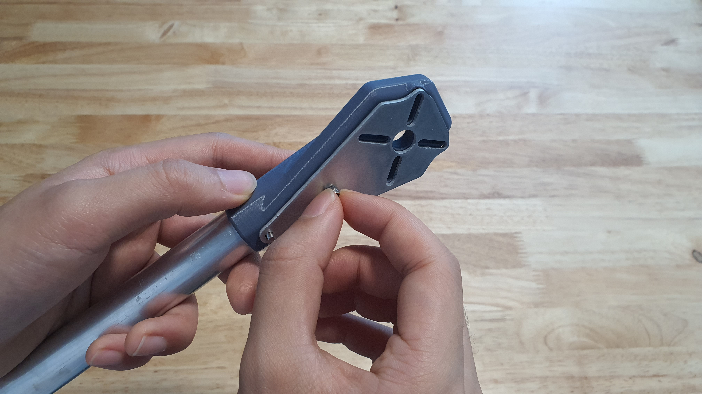<figcaption>
Hand tightening first screw end.
</figcaption></figure>

* Prepare (2x) M3 Nylon Lock Nuts.
* Align the Nylon Lock Nut to the first protruding screw end.
* Hand-tighten the Nut until resistance is felt.

<figure>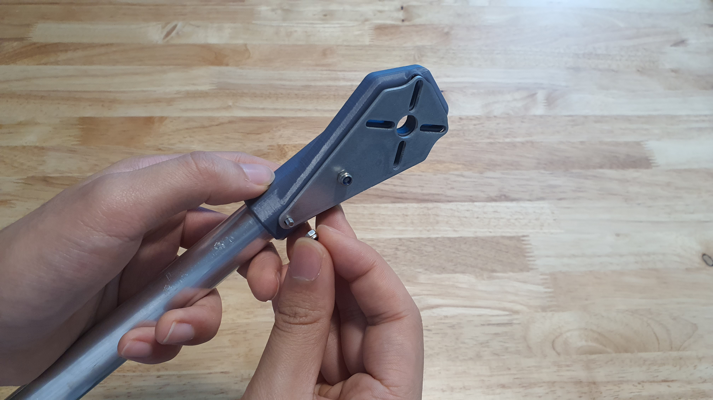<figcaption>
Aligning nut to the second screw end.
</figcaption></figure>

 

<figure>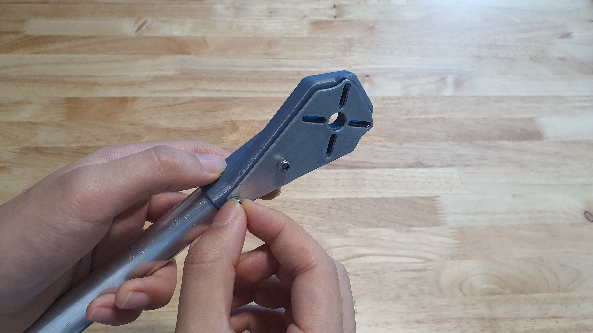<figcaption>
Hand tightening second screw end.
</figcaption></figure>

* Repeat this process for the second screw end.

## Step 5: Tightening Assembly

<figure>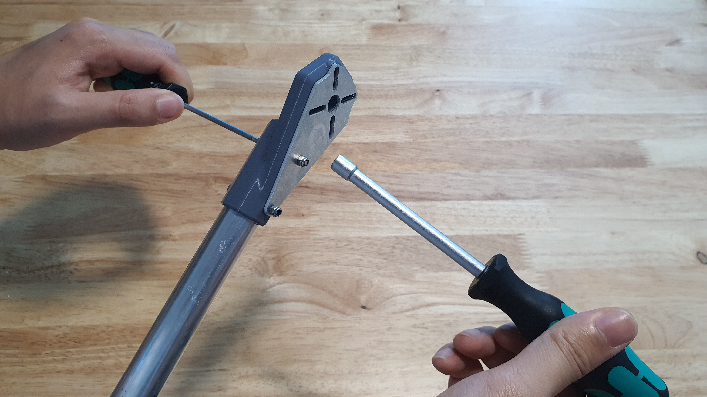<figcaption>
Preparing tools for torquing first fastener assembly.
</figcaption></figure>

 

<figure>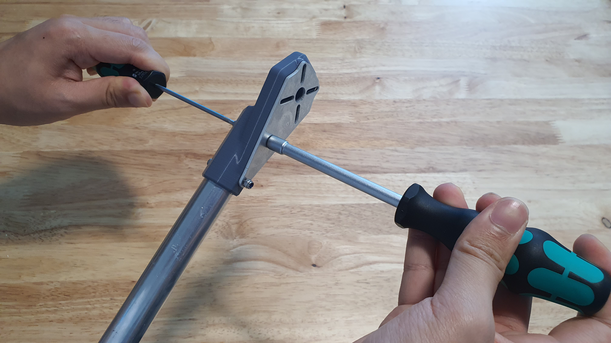<figcaption>
Torquing first fastener assembly.
</figcaption></figure>

* Prepare a 5.5 mm hex nut wrench or driver and a 2.5 mm hex screwdriver
* Use the screwdriver and wrench to tighten the first fastener assembly.
* Ensure the four slots and holes on the motor side of the Thrust Plate and Motor Mount are aligned during tightening.


Hand tighten only! Torque from a power tool may cause damage!


<figure>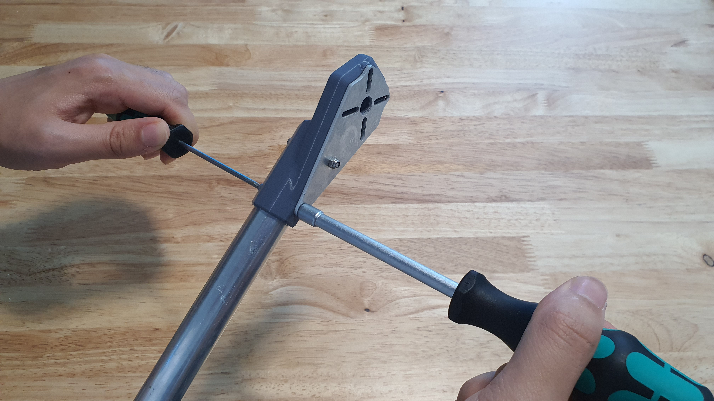<figcaption>
Torquing second fastener assembly.
</figcaption></figure>

* Repeat this step for the second fastener assembly.

<figure>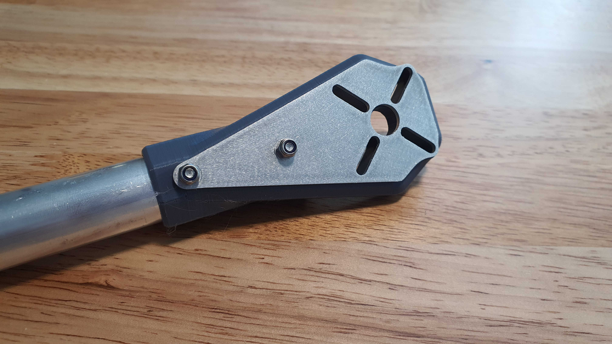<figcaption>
Finished Motor Mount and Arm assembly.
</figcaption></figure>

## Step 6: Repeat

<figure>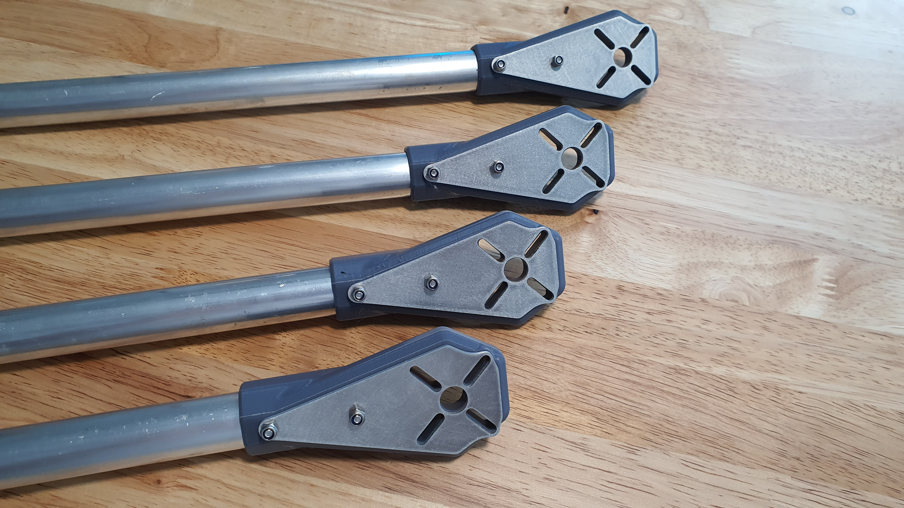<figcaption>
All four arms aseembled.
</figcaption></figure>

* Repeat this section for the remaining three Arm Tubes and three Motor Mounts.

## Step 7: Section 2 Finished


Congratulations! You are now ready to move onto Section 3.&#x20;

