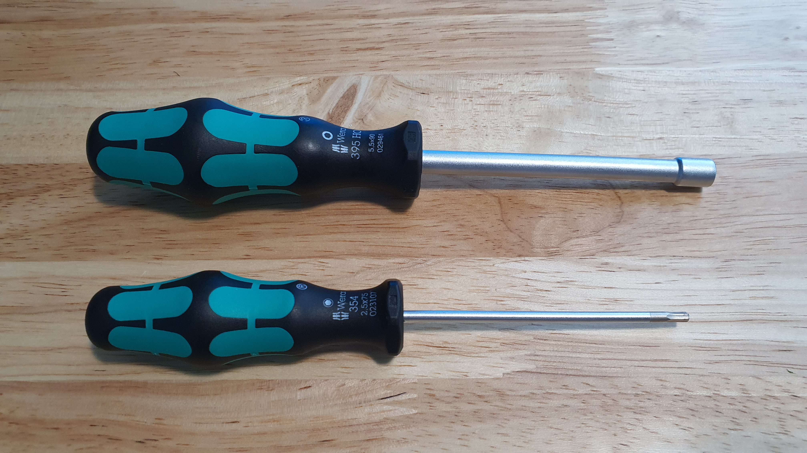
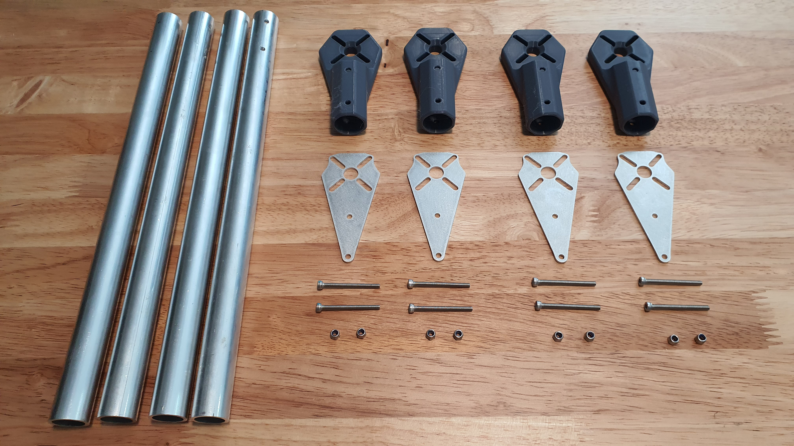

# 2. Motor Mount

## Tools for this section

<figure><figcaption>
Tools
</figcaption></figure>

* 5.5 mm hex nut wrench or driver
* 2.5 mm hex screwdriver

## Parts for this section

<figure><figcaption></figcaption></figure>

* 4x Arm Tubes
* 4x Motor Mount
* 4x Motor Thrust Plate
* 8x M3x30mm Socket Head Cap Screws
* 8x M3 Nylon Lock Nut

## Step 1

