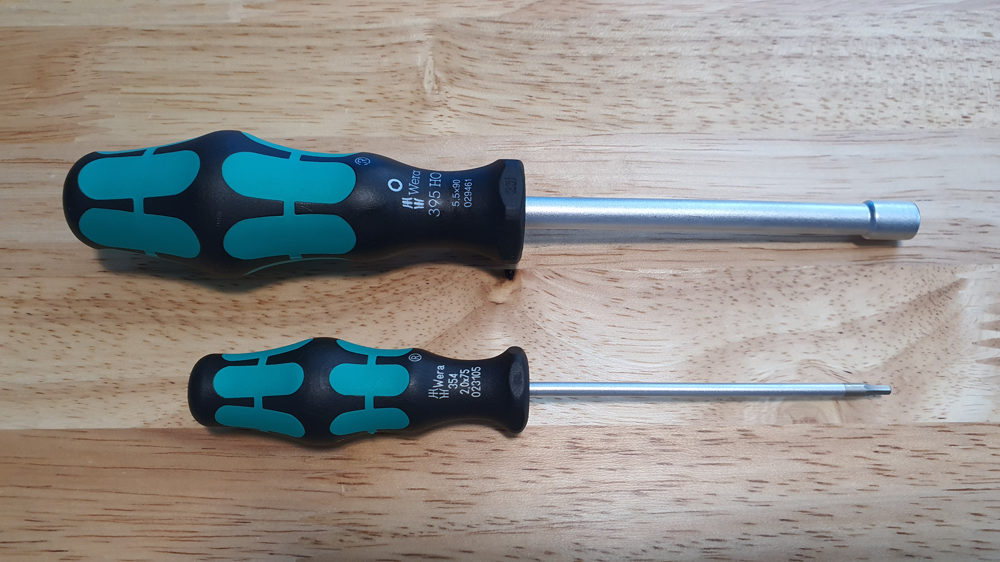
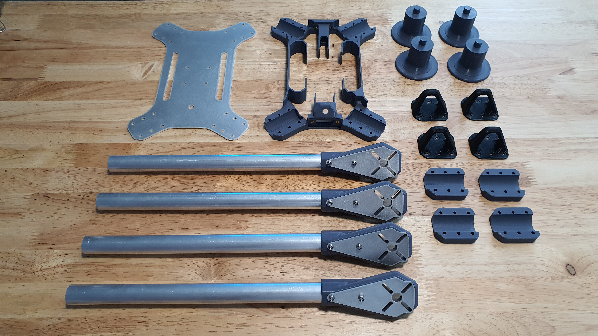
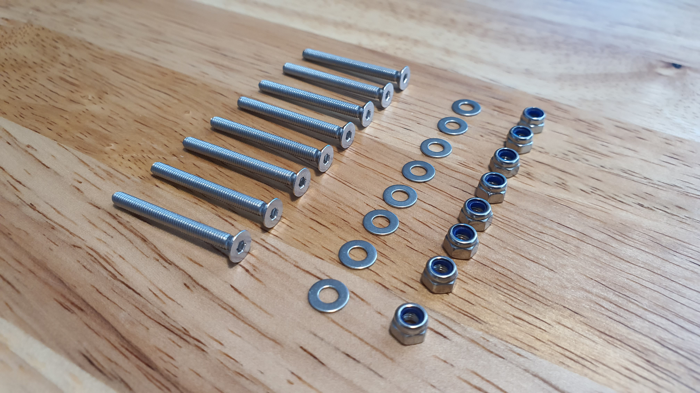

# 3. Airframe Structure

## Tools for this section

<figure><figcaption>
Tools.
</figcaption></figure>

* 5.5 mm hex nut wrench or driver
* 2 mm hex screwdriver

## Parts for this section

<figure><figcaption>
Parts for this section.
</figcaption></figure>

 

<figure><figcaption>
(8x) M3x30mm Flat Head Screws, M3 Washers, and Nylon Lock Nut.
</figcaption></figure>

#### Parts:

* Airframe Bottom
* Main Body
* (4x) Arm Brackets
* (4x) Landing Gears
* (4x) Arm Alignment Tool
* (4x) Arm Assemblies (from [Section 2.](2.-arm-assembly.md))

#### Fasteners:

* (8x) M3x30mm Flat Head Screws
* (8x) M3 Washer
* (8x) M3 Nylon Lock Nut

