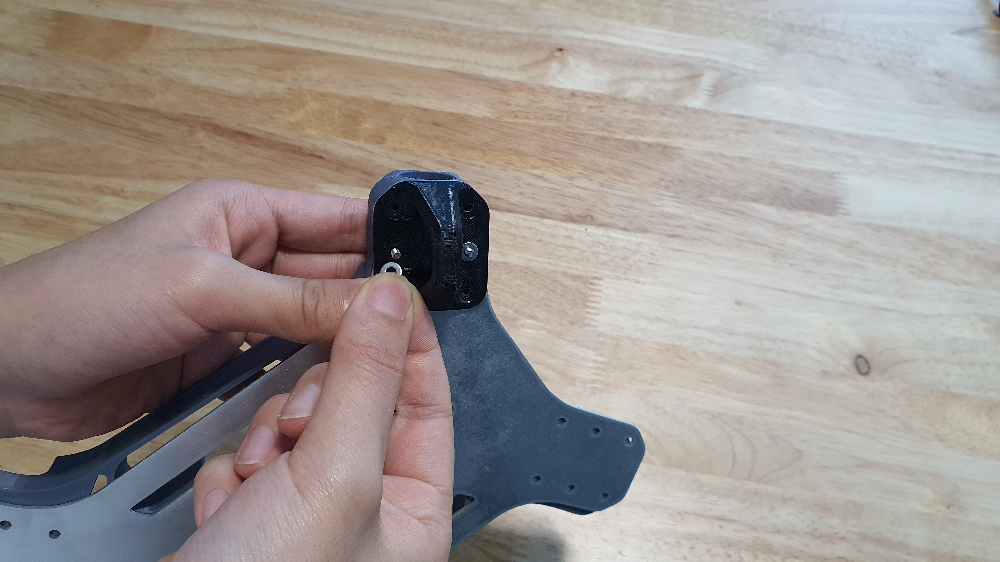

# 3. Airframe Structure

## StepsTools for this section

<figure><figcaption>
Tools.
</figcaption></figure>

* 2 mm hex screwdriver
* Pliers

## Parts for this section

<figure><figcaption>
Parts for this section.
</figcaption></figure>

 

<figure><figcaption>
(8x) M3x30mm Flat Head Screws, M3 Washers, and Nylon Lock Nut.
</figcaption></figure>

#### Parts:

* Airframe Bottom
* Main Body
* (4x) Arm Brackets
* (4x) Landing Gears
* (4x) Arm Alignment Tool
* (4x) Arm Assemblies (from [Section 2.](2.-arm-assembly.md))

#### Fasteners:

* (8x) M3x30mm Flat Head Screws
* (8x) M3 Washer
* (8x) M3 Nylon Lock Nut

## Step 1: Airframe Stack

<figure><figcaption>
Parts before stacking.
</figcaption></figure>

 

<figure><figcaption>
Stacked parts.
</figcaption></figure>

* Prepare the Airframe Bottom and Main body.
* Stack the Main Body on top of the Airframe Bottom.
* Align the parts.

<figure><figcaption>
Antenna Hole.
</figcaption></figure>

<figure><figcaption>
Correct direction of Airframe Bottom alignment.
</figcaption></figure>

 

<figure><figcaption>
Incorrect direction of Airframe Bottom alignment.
</figcaption></figure>

* Ensure the antenna mount hole is facing the correct side.
* Turn the stack upright to check that the hole is facing the XT-90 Mount side and NOT the FPV Camera Mount side.

## Step 2: Arm Bracket Assembly

<figure><figcaption>
Aligning Arm Bracker to Airframe Stack.
</figcaption></figure>

* Prepare (1x) Arm Bracket, Airframe Stack, (2x) M3x30mm Flat Head Screws, (2x) M3 Washer, and (2x) M3 Nylon Lock Nut.
* Align the Arm Bracket to one of the four corners of the Airframe Stack.

<figure><figcaption></figcaption></figure>

 

<figure><figcaption></figcaption></figure>

* Insert the M3x30mm Flat Head Screw into the chamfered holes on the Arm Bracket.
* Ensure the screws are inserted into the center hole of the row of three holes.
* Align the full stack of parts until the screw ends exit the Airframe Bottom plate.

<figure><figcaption>
Screw ends exiting out Airframe Bottom.
</figcaption></figure>

## Step 3: Landing Gear Assembly

<figure><figcaption>
Aligning Landing Gear to the screw ends.
</figcaption></figure>

 

<figure><figcaption>
Inserting Landing Gear into screw ends.
</figcaption></figure>

* Prepare the (1x) Landing Gear.
* Align the center holes on the Landing Gear to the&#x20;

## Step 4: Fastening Arm Bracket

<figure><figcaption>
Inserting first M3 Washer.
</figcaption></figure>

 

<figure><figcaption>
Inserting second M3 Washer.
</figcaption></figure>

* Prepare (2x) M3 Washer and (2x) M3 Nylon Lock Nut.
* Insert M3 Washers into each screw end on the bottom of the assembly.

<figure><figcaption>
Inserting first M3 Lock Nut.
</figcaption></figure>

 

<figure><figcaption>
Inserting second M3 Lock Nut.
</figcaption></figure>

* Loosely screw in the M3 Nylon Lock Nut


**LOOSELY** screw in the nut, do not tighten. The nuts will be tightened in a later step.


<figure><figcaption>
Completed assembly.
</figcaption></figure>

 

<figure><figcaption>
Completed assembly side view.
</figcaption></figure>

## Step 5: Repeat

* Repeat Step 1-4 for the remaining three corners.

<figure><figcaption></figcaption></figure>

## Step 6: Arm Installation

<figure><figcaption></figcaption></figure>

 

<figure><figcaption></figcaption></figure>

* Prepare (4x) Arm Assemblies.
* Insert one Arm Assembly into the hole of the Arm Bracket on one of the corners.
* Ensure the Arm Tube is seated all the way.

<figure><figcaption></figcaption></figure>

* Repeat for the remaining three arms.

## Step 7:&#x20;

<figure><figcaption></figcaption></figure>

 

<figure><figcaption></figcaption></figure>

* k

<figure><figcaption>
Ensure 
</figcaption></figure>

 

<figure><figcaption></figcaption></figure>

