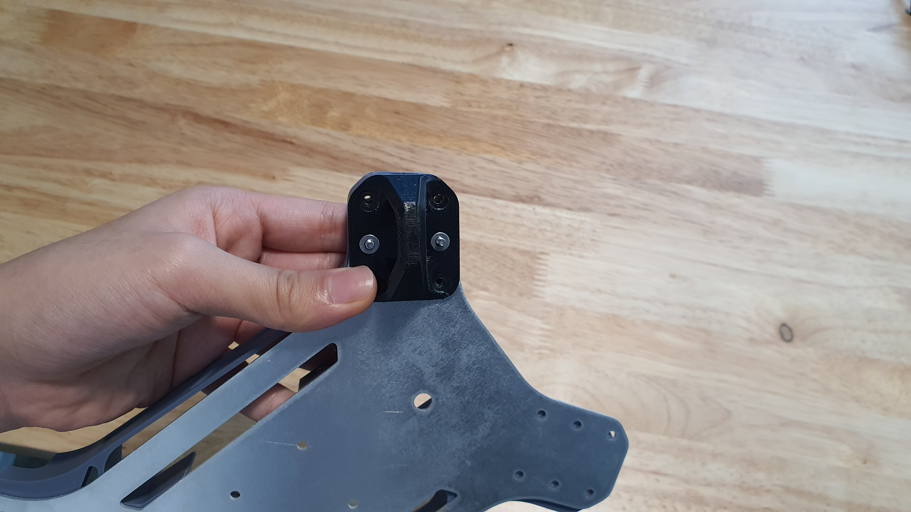

# 3. Airframe Structure

## Tools for this section

<figure><figcaption>
Tools.
</figcaption></figure>

* 2 mm hex screwdriver
* Pliers

## Parts for this section

<figure><figcaption>
Parts for this section.
</figcaption></figure>

 

<figure><figcaption>
(8x) M3x30mm Flat Head Screws, M3 Washers, and Nylon Lock Nut.
</figcaption></figure>

#### Parts:

* Airframe Bottom
* Main Body
* (4x) Arm Brackets
* (4x) Landing Gears
* (4x) Arm Alignment Tool
* (4x) Arm Assemblies (from [Section 2.](2.-arm-assembly.md))

#### Fasteners:

* (8x) M3x30mm Flat Head Screws
* (8x) M3 Washer
* (8x) M3 Nylon Lock Nut

## Step 1:

<figure><figcaption>
Parts before stacking.
</figcaption></figure>

 

<figure><figcaption>
Stacked parts.
</figcaption></figure>

* Prepare the Airframe Bottom and Main body.
* Stack the Main Body on top of the Airframe Bottom.
* Align the parts.

<figure><figcaption>
Antenna Hole.
</figcaption></figure>

<figure><figcaption>
Correct direction of Airframe Bottom alignment.
</figcaption></figure>

 

<figure><figcaption>
Incorrect direction of Airframe Bottom alignment.
</figcaption></figure>

* Ensure the antenna mount hole is facing the correct side.
* Turn the stack upright to check that the hole is facing the XT-90 Mount side and NOT the FPV Camera Mount side.

## Step 2:&#x20;

<figure><figcaption></figcaption></figure>

* k

<figure><figcaption></figcaption></figure>

 

<figure><figcaption></figcaption></figure>

* k

<figure><figcaption></figcaption></figure>

## Step 3:

<figure><figcaption></figcaption></figure>

 

<figure><figcaption></figcaption></figure>

* k

## Step 4:

<figure><figcaption></figcaption></figure>

 

<figure><figcaption></figcaption></figure>

* k

<figure><figcaption></figcaption></figure>

## Step 5:

<figure><figcaption></figcaption></figure>

 

<figure><figcaption></figcaption></figure>

* l


Loosely screw in the nut, do not tighten. The nuts will be tightened in a later step.


<figure><figcaption></figcaption></figure>

 

<figure><figcaption></figcaption></figure>

