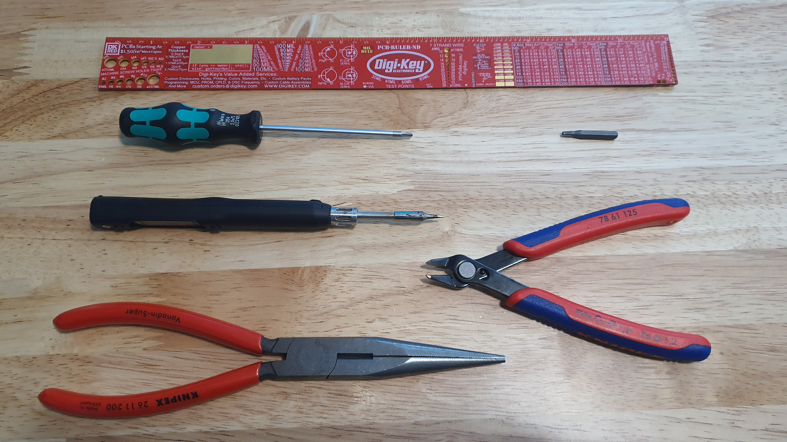
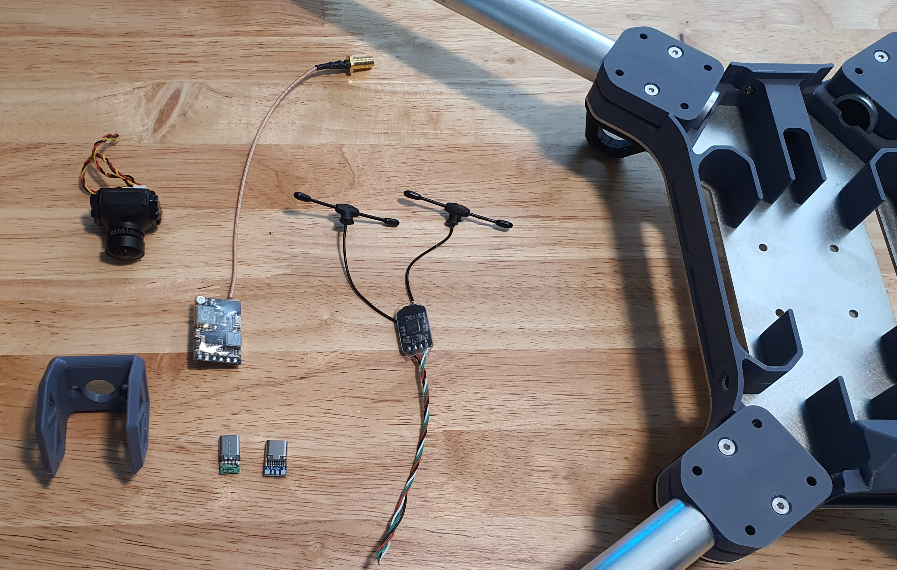
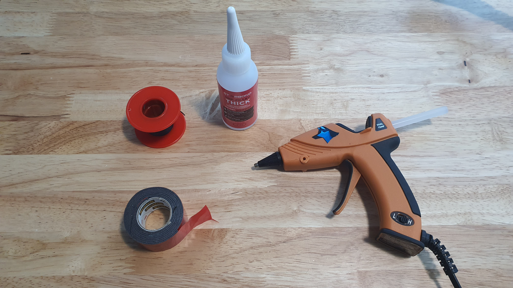

# 4. FPV, USB, & RX Electronics

## Tools for this section

<figure><figcaption></figcaption></figure>

* Ruler
* 2 mm hex screwdriver
* Soldering iron
* Pliers
* Wire snips
* Screw driver bit (Size of FPV camera mounting screws)

## Parts for this section

<figure><figcaption>
Parts for this section.
</figcaption></figure>

 

<figure><figcaption>
Consumables for this section.
</figcaption></figure>

 

<figure><figcaption>
Fasteners for this section.
</figcaption></figure>

**Parts:**

* Airframe Assembly (from[ Section 3.](3.-airframe-structure.md))
* (1x) FPV Camera Mount
* (1x) RC Receiver
* (1x) FPV Transmitter
* (1x) FPV Camera
* (1x) USB C Breakout Male
* (1x) USB C Breakout Female
* Hot Glue
* CA Glue
* Double sided tape
* 30 AWG Silicone Wire

**Fasteners:**

*

## Step 1: Receiver Mounting

<figure><figcaption></figcaption></figure>

 

<figure><figcaption></figcaption></figure>

