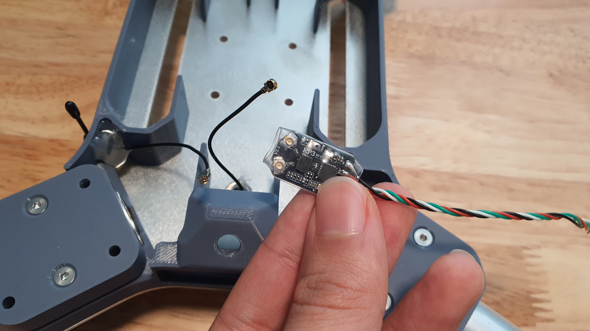

# 4. FPV, USB, & RX Electronics

## Tools for this section

<figure><figcaption></figcaption></figure>

* Ruler
* 2 mm hex screwdriver
* Soldering iron
* Pliers
* Wire snips
* Screw driver bit (Size of FPV camera mounting screws)

## Parts for this section

<figure><figcaption>
Parts for this section.
</figcaption></figure>

 

<figure><figcaption>
Consumables for this section.
</figcaption></figure>

 

<figure><figcaption>
Fasteners for this section.
</figcaption></figure>

**Parts:**

* Airframe Assembly (from[ Section 3.](3.-airframe-structure.md))
* (1x) FPV Camera Mount
* (1x) RC Receiver
* (1x) FPV Transmitter
* (1x) FPV Camera
* (1x) USB C Breakout Male
* (1x) USB C Breakout Female
* Hot Glue
* CA Glue
* Double-sided tape
* 30 AWG Silicone Wire

**Fasteners:**

* M3x6mm Flat Head
* FPV Camera Mounting Screws (comes with your FPV camera)

## Step 1: Receiver Antenna Mounting

<figure><figcaption></figcaption></figure>

 

<figure><figcaption></figcaption></figure>

* Prepare the Airframe assembly, RC Receiver module, and hot glue.&#x20;
* Carefully disconnect the RC Receiver antenna UFL connectors from the PCB.

<figure><figcaption></figcaption></figure>

 

<figure><figcaption></figcaption></figure>

* Locate the receiver antenna mounting hole on the Main Body 3D printed part.
* Insert one of the receiver antennas from the outside, and guide the antenna wire into the airframe.

<figure><figcaption></figcaption></figure>

 

<figure><figcaption></figcaption></figure>

* Hold the antenna upright from the outside, and add hot glue on the inside to secure the antenna in place.

<figure><figcaption></figcaption></figure>

 

<figure><figcaption></figcaption></figure>

* Once the hot glue has cooled, turn the airframe upside down.
* Insert the second receiver antenna wire into the antenna mount hole.

<figure><figcaption></figcaption></figure>

* Ensure the antenna "T" is parallel to the bottom and top edge of the bottom airframe plate edges.

<figure><figcaption></figcaption></figure>

 

<figure><figcaption></figcaption></figure>

* Hold the antenna down, ensuring it will not shift.
* Carefully flip the airframe back to it's nominal orientation.

<figure><figcaption></figcaption></figure>

* While holding the receiver antenna, carefully add hot glue from the inside of the airframe to keep the bottom antenna in place.

## Step 2: Receiver Mounting

<figure><figcaption></figcaption></figure>

 

<figure><figcaption></figcaption></figure>

* k

<figure><figcaption></figcaption></figure>

 

<figure><figcaption></figcaption></figure>

* j

<figure><figcaption></figcaption></figure>

 

<figure><figcaption></figcaption></figure>

* h

## Step 3: FPV Transmitter Mounting

<figure><figcaption></figcaption></figure>

 

<figure><figcaption></figcaption></figure>

* h

<figure><figcaption></figcaption></figure>

 

<figure><figcaption></figcaption></figure>

* j

<figure><figcaption></figcaption></figure>

 

<figure><figcaption></figcaption></figure>

* l

## Step 4: FPV Antenna Mount

<figure><figcaption></figcaption></figure>

 

<figure><figcaption></figcaption></figure>

* h

<figure><figcaption></figcaption></figure>

 

<figure><figcaption></figcaption></figure>

* h

<figure><figcaption></figcaption></figure>

 

<figure><figcaption></figcaption></figure>

* h

## Step 5: Mounting FPV Camera

<figure><figcaption></figcaption></figure>

 

<figure><figcaption></figcaption></figure>

* h

<figure><figcaption></figcaption></figure>

 

<figure><figcaption></figcaption></figure>

* o

<figure><figcaption></figcaption></figure>

 

<figure><figcaption></figcaption></figure>

