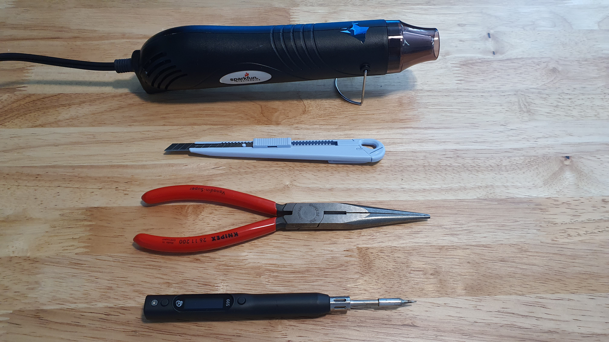
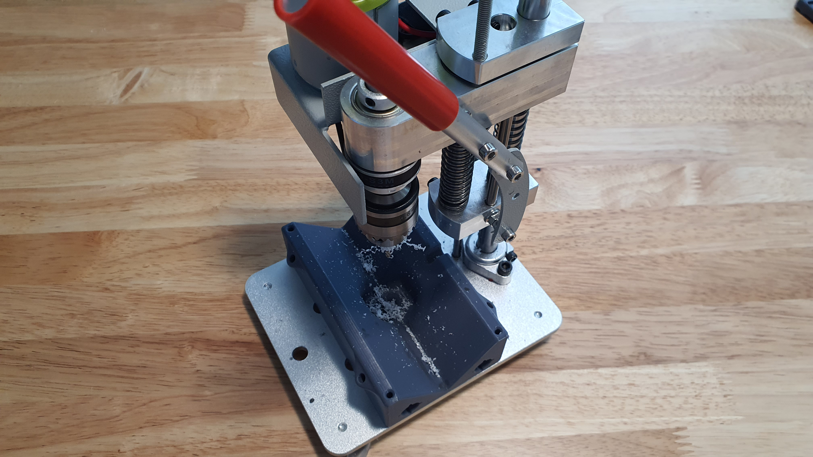
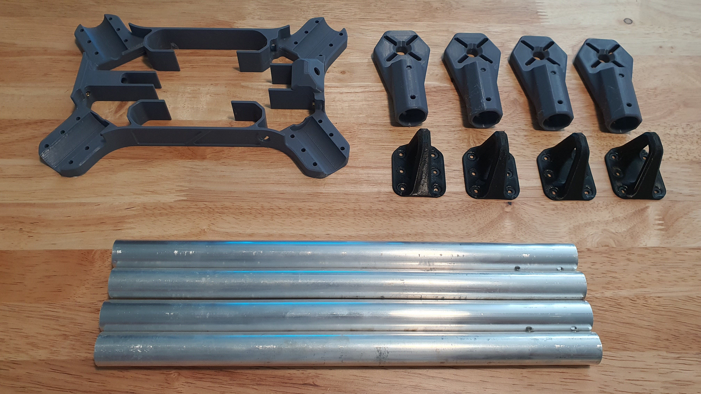
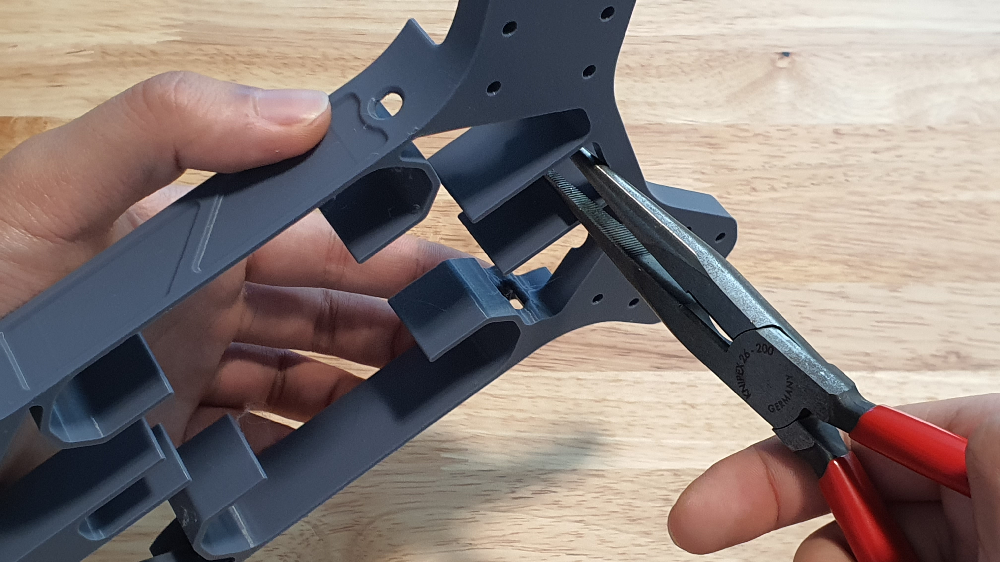
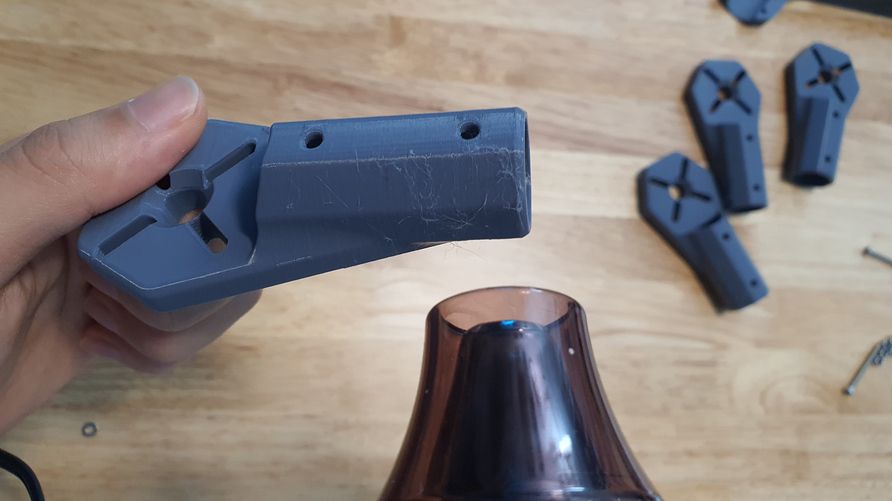

# Chapter 1: Part Preparation

## Tools for this chapter

<figure><figcaption>
Tools
</figcaption></figure>

 

<figure><figcaption>
Press Drill
</figcaption></figure>

* Hot Air Gun
* Hobby Knife
* Pliers
* Soldering Iron
* Press Drill
* 3.2 mm drill bit

## Parts for this chapter

<figure><figcaption></figcaption></figure>

* Main Body 3D Print
* 4x Motor Mount 3D Print
* 4x Arm Tubes
* 4X

## Step 1: Support Removal

<figure><figcaption></figcaption></figure>

 

<figure><figcaption></figcaption></figure>

Remove the supports on the Main Body, Motor Mount, and Landing 3D printed parts.\
\
Use the hobby knife to clean any support residue and the heat gun to melt any stringing.\
\
Step 2: Ds

## Step 2: Cut Arm Tubes

## Step 3: Drill Arm Tube
