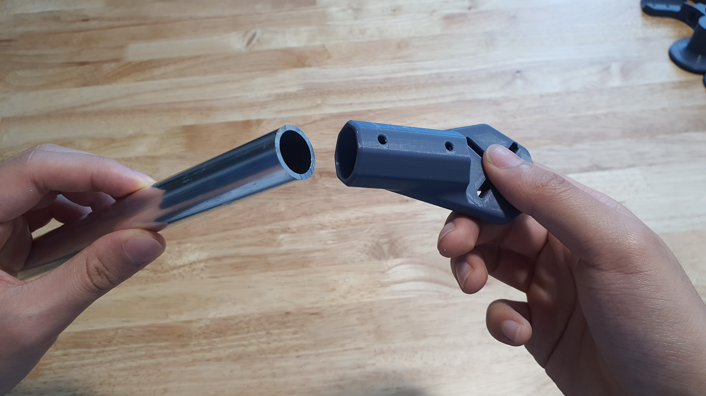
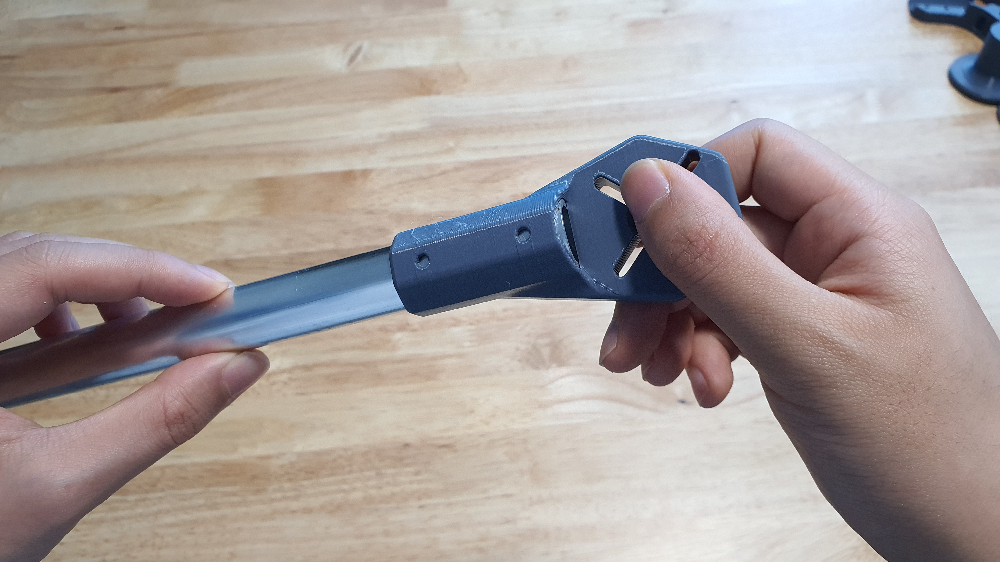

# Chapter 1: Part Preparation

## Tools for this chapter

<figure><figcaption>
Tools
</figcaption></figure>

 

<figure><figcaption>
Press drill with 3.2 mm drill bit.
</figcaption></figure>

* Hot Air Gun
* Hobby Knife
* Pliers
* Soldering Iron
* Marker
* Press Drill
* 3.2 mm drill bit

## Parts for this chapter

<figure><figcaption>
Parts for this chapter.
</figcaption></figure>

* Main Body 3D Print
* 4x Motor Mount 3D Print
* 4x Arm Tubes
* 4x Landing Gear

##

## Step 1: Support Removal

<figure><figcaption>
Support Removal with Pliers.
</figcaption></figure>

 

<figure><figcaption>
Heat Gun.
</figcaption></figure>

* Remove the supports on the Main Body, Motor Mount, and Landing 3D-printed parts with the pliers.&#x20;
* Use the hobby knife to clean any support residue and the heat gun to melt any stringing.

<figure><figcaption>
Cleaned 3D printed parts.
</figcaption></figure>


Once the 3D-printed parts have been prepared, they are ready for the next step.


##

## Step 2: Cutting Arm Tubes

* If the arm tubes are not pre-cut to length, this is the step to do so.&#x20;
* It is reccomended to order the arm tubes pre-cut to size to minimize hazards.&#x20;


The appropriate arm tube length is determined by the selected prop width. Check that your arm tubes and prop length appropriately match in the [Arm Tubes](../../hardware-parts-list/arm-tubes.md#reccomended-tube-length) section.&#x20;



If pre-cut tubes are not an available option, proceed with cutting the tubes at your own risk! Cutting tubes requires dangerous tools. With carbon fiber tubes, the dust presents a dangerous health and safety hazard. Proceed with caution at your own risk!

How to cut alumnium tubes:

[https://youtu.be/eEnvGZbe370?feature=shared](https://youtu.be/eEnvGZbe370?feature=shared)\
\
Carbon fiber dust saftey:\
[https://youtu.be/EWzN6GZeEzs?feature=shared\&t=93](https://youtu.be/EWzN6GZeEzs?feature=shared\&t=93)

How to cut carbon fiber tubes:\
[https://youtu.be/EWzN6GZeEzs?feature=shared\&t=990](https://youtu.be/EWzN6GZeEzs?feature=shared\&t=990)


##

## Step 3: Marking Arm Tubes

<figure><figcaption></figcaption></figure>

 

<figure><figcaption></figcaption></figure>

* Insert the arm tube into the Motor Mount.&#x20;
* Use the Motor Mount screw holes as a stencil for the marker.

<figure><figcaption>
Motor Mount top.
</figcaption></figure>

 

<figure><figcaption></figcaption></figure>

* Draw a spot to mark the location for the drill bit.
* Repeat this for both the top of the motor mount and bottom, being careful to not rotate the motor mount in the process.
* There should be a total of four holes marked per arm tube.


Marking only needs to be done on one end of each arm tube. Repeat this step for all four arm tubes.


## Step 4: Drilling Arm Tubes

<figure><figcaption></figcaption></figure>
