# 1. Part Preparation-

## Tools for this section

<figure>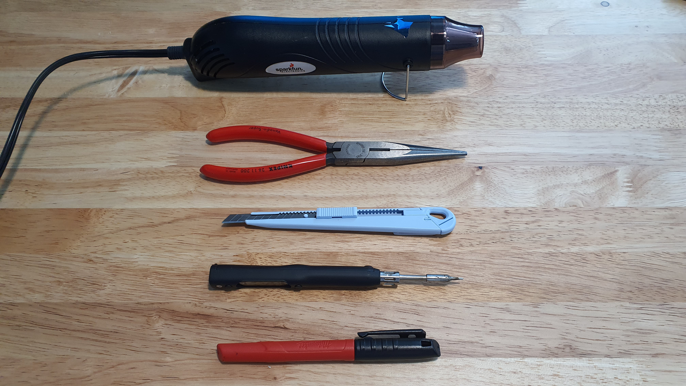<figcaption>
Tools
</figcaption></figure>

 

<figure><figcaption>
Press drill with 3.2 mm drill bit.
</figcaption></figure>

* Hot Air Gun
* Hobby Knife
* Pliers
* Soldering Iron
* Marker
* Press Drill
* 3.2 mm drill bit

## Parts for this section

<figure><figcaption>
Parts for this section.
</figcaption></figure>

 

<figure>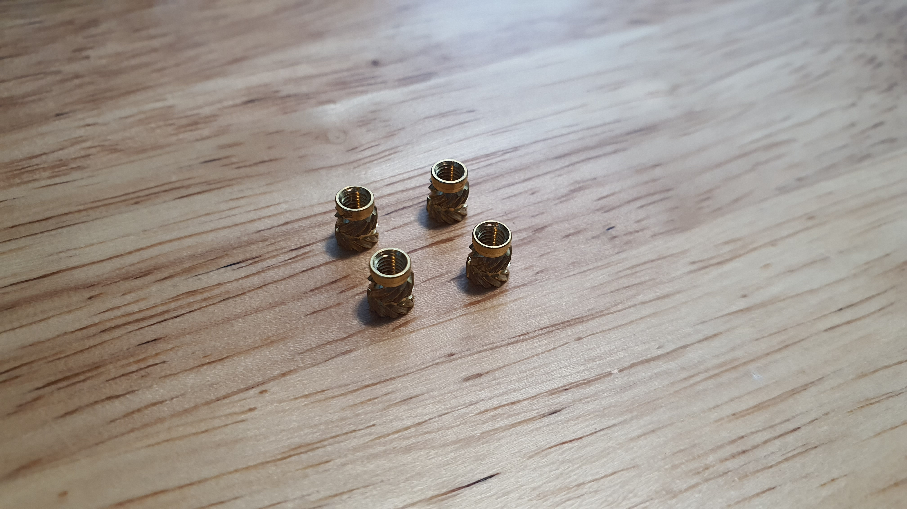<figcaption>
(4x) M3 Threaded Inserts.
</figcaption></figure>

#### Parts:

* Main Body 3D Print
* (4x) Motor Mount 3D Print
* (4x) Arm Tubes
* (4x) Landing Gear

#### Fasteners:

* (4x) M3 Threaded Inserts

## Step 1: Support Removal

<figure><figcaption>
Support Removal with Pliers.
</figcaption></figure>

 

<figure><figcaption>
Heat Gun.
</figcaption></figure>

* Prepare the Main Body, Motor Mount, and Landing gear 3D Prints.
* Remove the support material with the pliers.&#x20;
* Use the hobby knife to clean any support residue and the heat gun to melt any stringing.

<figure>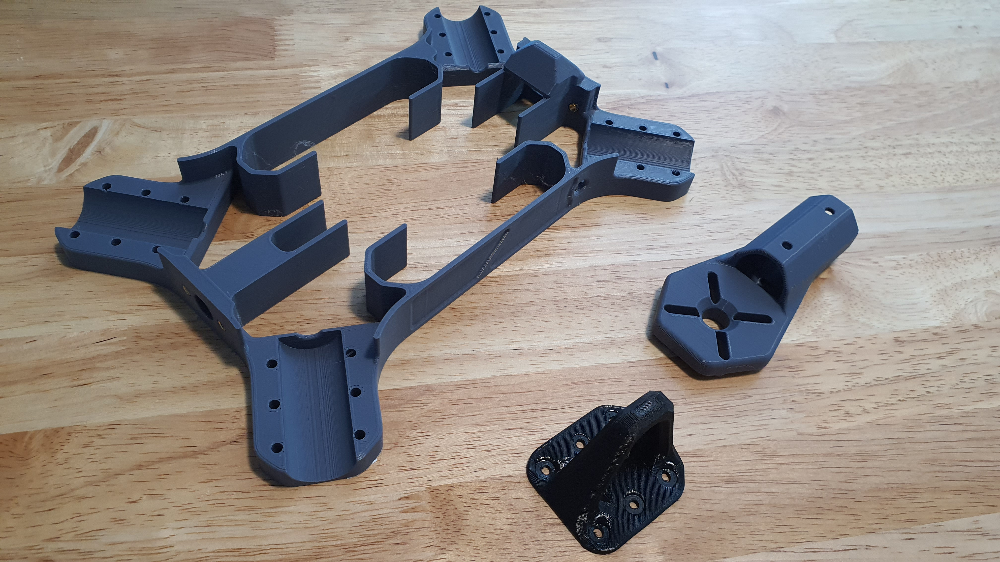<figcaption>
Cleaned 3D printed parts.
</figcaption></figure>


Once the 3D-printed parts have been prepared, they are ready for the next step.


## Step 2: Cutting Arm Tubes

* If the arm tubes are not pre-cut to length, this is the step to do so.&#x20;
* It is reccomended to order the arm tubes pre-cut to size to minimize hazards.&#x20;


The appropriate arm tube length is determined by the selected prop width. Check that your arm tubes and prop length appropriately match in the [Arm Tubes](../../hardware-parts-list/arm-tubes.md#reccomended-tube-length) section.&#x20;



If pre-cut tubes are not an available option, proceed with cutting the tubes at your own risk! Cutting tubes requires dangerous tools. With carbon fiber tubes, the dust presents a dangerous health and safety hazard. Proceed with caution at your own risk!

How to cut alumnium tubes:

[https://youtu.be/eEnvGZbe370?feature=shared](https://youtu.be/eEnvGZbe370?feature=shared)\
\
Carbon fiber dust saftey:\
[https://youtu.be/EWzN6GZeEzs?feature=shared\&t=93](https://youtu.be/EWzN6GZeEzs?feature=shared\&t=93)

How to cut carbon fiber tubes:\
[https://youtu.be/EWzN6GZeEzs?feature=shared\&t=990](https://youtu.be/EWzN6GZeEzs?feature=shared\&t=990)


## Step 3: Marking Arm Tubes

<figure>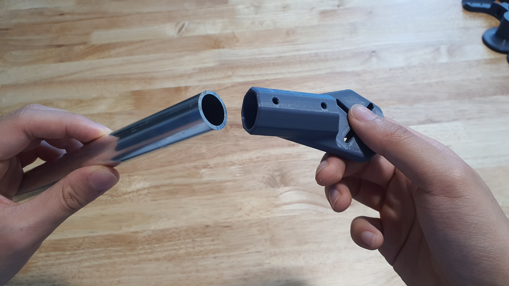<figcaption>
Inserting Motor Mount to Arm Tube.
</figcaption></figure>

 

<figure>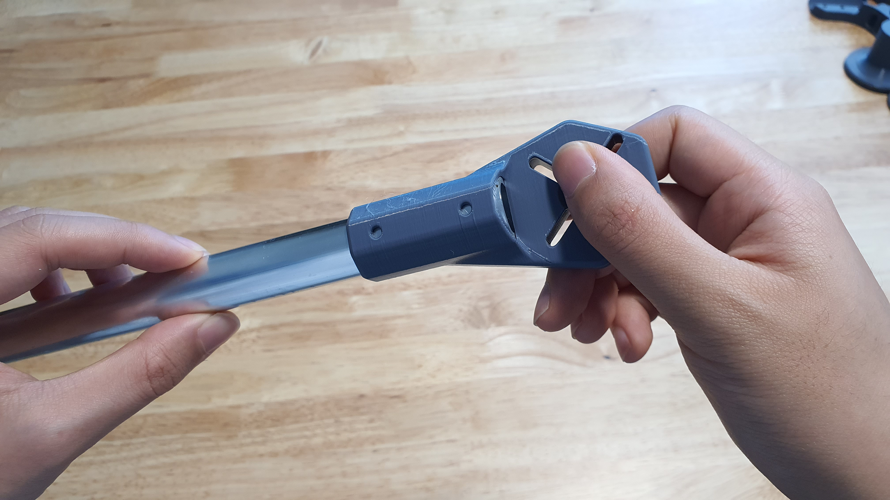<figcaption>
Ensuring Motor Mount is inserted all the way.
</figcaption></figure>

* Prepare the cut arm tubes and a Motor Mount 3D print.
* Insert the arm tube into the Motor Mount.&#x20;
* Use the Motor Mount screw holes as a stencil for the marker.

<figure>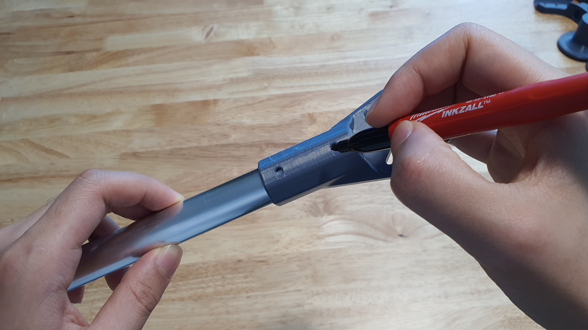<figcaption>
Marking holes on top of Motor Mount.
</figcaption></figure>

 

<figure>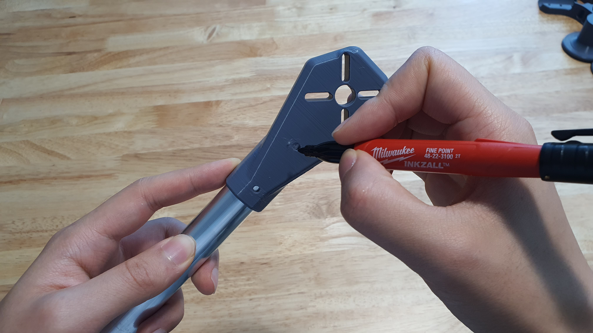<figcaption>
Marking holes on bottom of Motor Mount.
</figcaption></figure>

* Draw a spot to mark the location for the drill bit.
* Repeat this for both the top of the motor mount and bottom, being careful to not rotate the motor mount in the process.
* There should be a total of four holes marked per arm tube.


Marking only needs to be done on one end of each arm tube. Repeat this step for all four arm tubes.


## Step 4: Drilling Arm Tubes

<figure>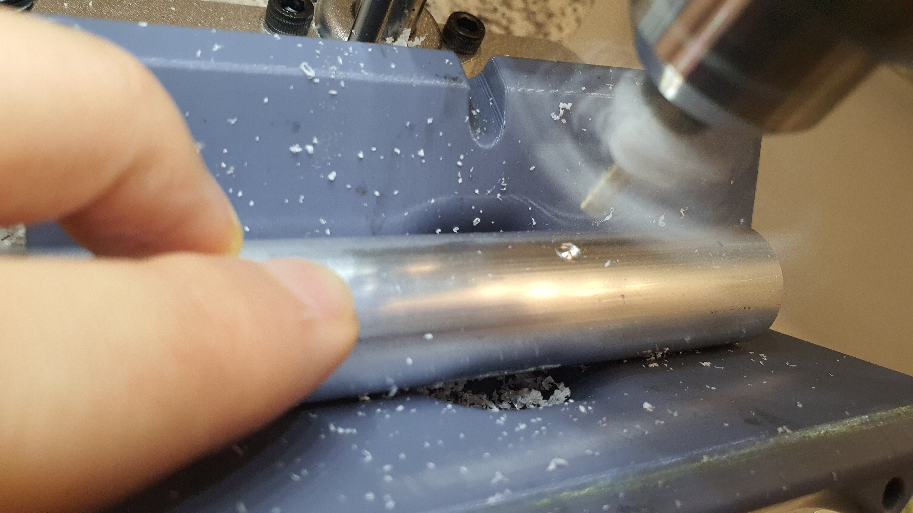<figcaption>
Drilling Arm Tube.
</figcaption></figure>

 

<figure>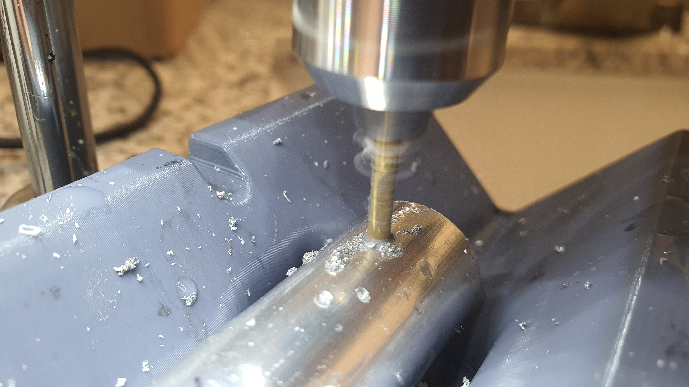<figcaption></figcaption></figure>

* Using the Press Drill and 3.2 mm Drill Bit, drill a hole for the spots marked on the arm tubes
* There should be a total of four holes drilled per arm tube.


For Aluminum arm tubes, use cutting oil or water to lubricate and cool the area during cutting.

For Carbon Fiber, proceed with caution while exercising carbon fiber dust safety practices: [https://youtu.be/EWzN6GZeEzs?feature=shared\&t=93](https://youtu.be/EWzN6GZeEzs?feature=shared\&t=93)


<figure>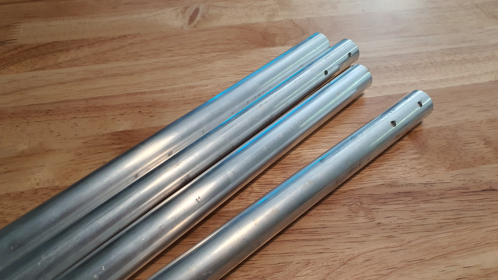<figcaption>
Four Arm Tubes with holes drilled.
</figcaption></figure>


Repeat this step for all four arm tubes. Set the tubes off to the side.


## Step 5: Main Body Threaded Inserts

<figure>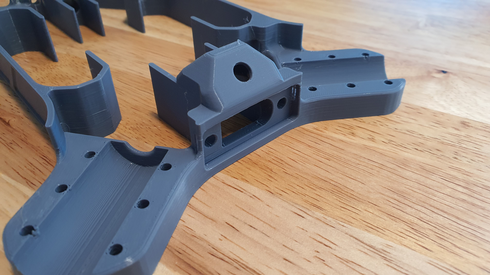<figcaption>
XT-90 Mount area without threaded insert.
</figcaption></figure>

 

<figure>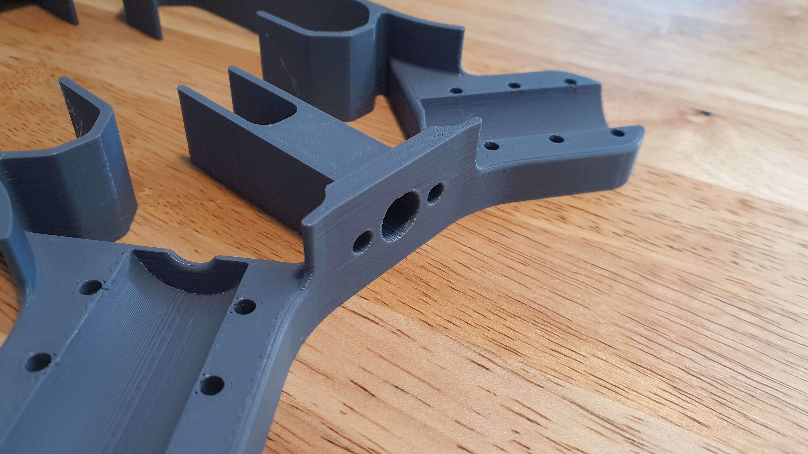<figcaption>
FPV Camera Mount holes without threaded insert.
</figcaption></figure>

* Prepare the Main Body 3D Print and the four M3 brass threaded inserts.
* Identify the XT-90 Mount and the FPV Camera Mounting Holes.
* Plug in the soldering iron and heat it up to 200-260 °C (400-500°F).


Use caution while using a soldering iron to prevent injury from burns!


<figure>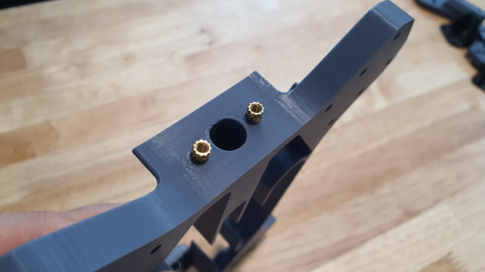<figcaption>
Threaded Inserts aligned to FPV Camera Mount holes.
</figcaption></figure>

 

<figure>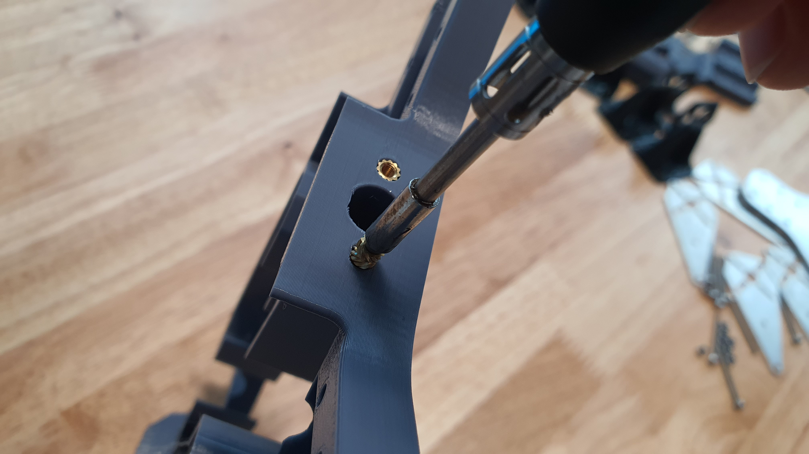<figcaption>
Heating threaded inserts with soldering iron.
</figcaption></figure>

* Insert two threaded inserts into the two smaller holes on the FPV Camera Mount holes.
* Use the soldering iron to carefully heat the threaded inserts.
* Apply light pressure until the threaded insert is seated flush with the surface of the 3D print.
* Turn the part around until the XT-90 Mount area is in view.

<figure>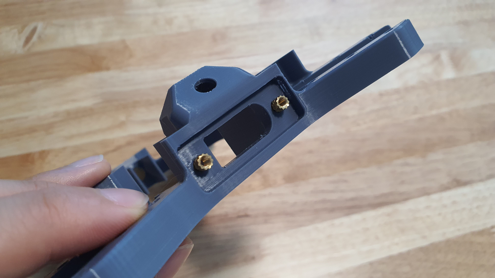<figcaption>
Threaded Inserts aligned with XT-90 Mount area.
</figcaption></figure>

 

<figure>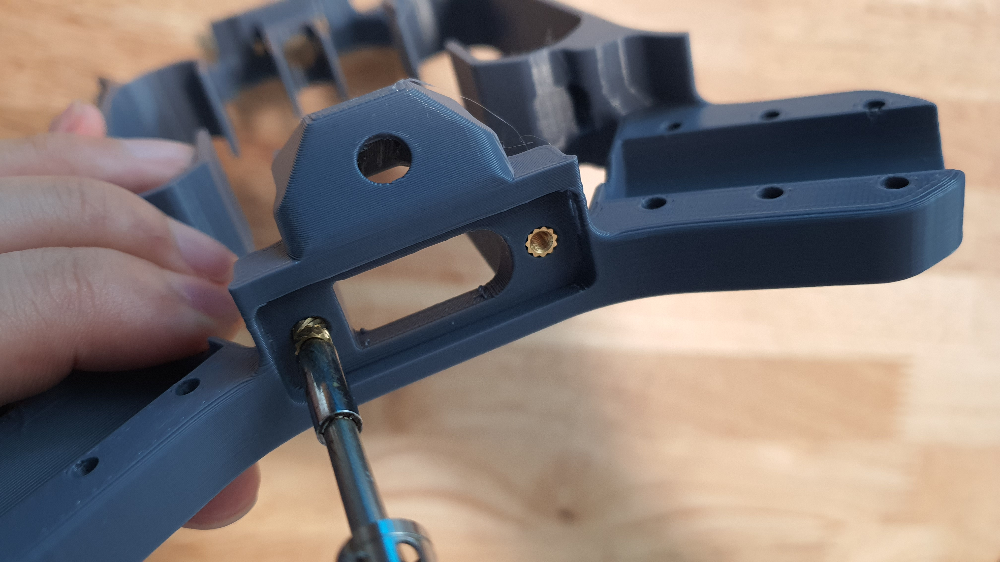<figcaption>
Heating threaded inserts with soldering iron.
</figcaption></figure>

* Insert two threaded inserts into the two smaller holes on the XT-90 Mount area.
* Use the soldering iron to carefully heat the threaded inserts.
* Apply light pressure until the threaded insert is seated flush with the surface of the 3D print.

<figure>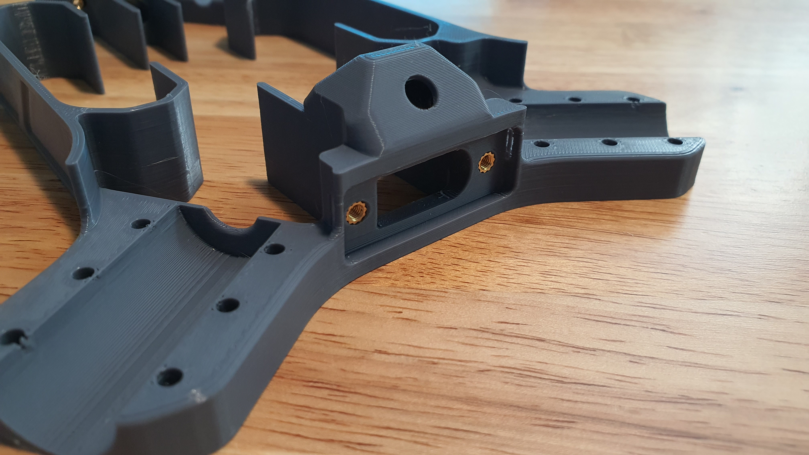<figcaption>
XT-90 Mount with threaded inserts fully set.
</figcaption></figure>

 

<figure>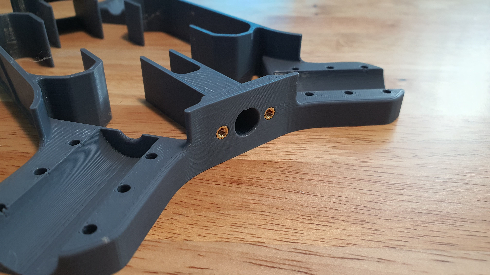<figcaption>
FPV Camera Mount holes with threaded inserts fully set.
</figcaption></figure>


Carefully store the soldering iron in a safe place, unplug it, and allow it to cool.


## Step 6: Section 1 Finished


Congratulations! You are now ready to move onto Section 2.&#x20;

