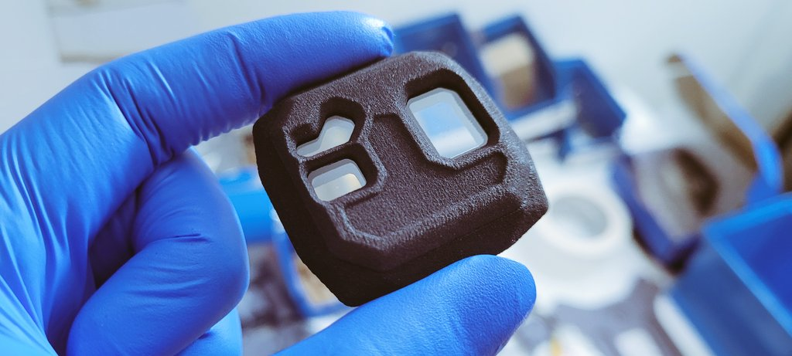

# ARK FLOW Enclosure

<figure><figcaption></figcaption></figure>

Genesis Bravo V2 and Genesis Edge AI Features the Ark Electronics Flow for precision GNSS denied position hold. We're opening up the design of the ARK Flow optical environmental enclosure for integrators to develop into their platforms.&#x20;

## 3D Files

Here

## Window DXF

## Assembly Instructions

