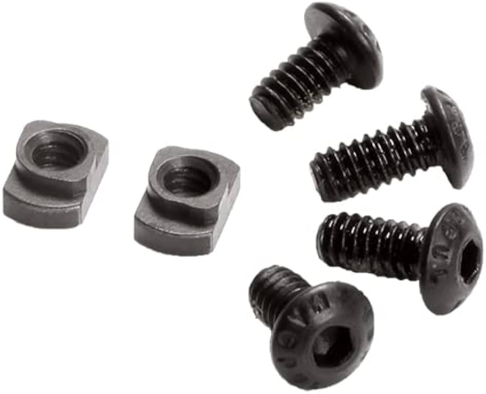

# Genesis Payload Rail Standard

Genesis features standard payload rails to allow easy integration of payloads, battery mounts, and more.

<figure><figcaption></figcaption></figure>

### M-Lok Compatible

Attaching payloads is done using M-Lok T-Nuts. The slots on Genesis are not M-Lok standard, they are longer to allow payload attachments to be slid into specific positions to allow mount configuration freedom.&#x20;

<figure><figcaption></figcaption></figure>
