# 3. Airframe Structure

## Tools for this section

<figure>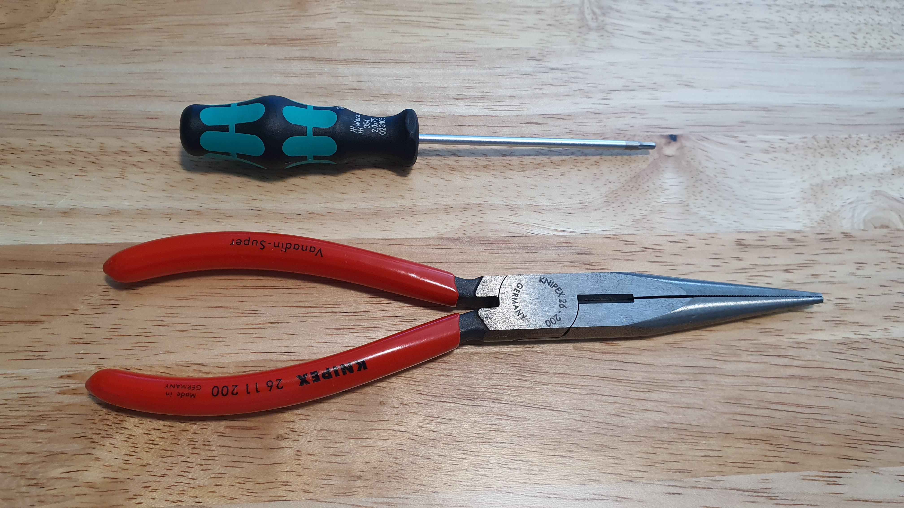<figcaption>
Tools.
</figcaption></figure>

* 2 mm hex screwdriver
* Pliers

## Parts for this section

<figure><figcaption>
Parts for this section.
</figcaption></figure>

 

<figure><figcaption>
(8x) M3x30mm Flat Head Screws, M3 Washers, and Nylon Lock Nut.
</figcaption></figure>

#### Parts:

* Airframe Bottom
* Main Body
* (4x) Arm Brackets
* (4x) Landing Gears
* (4x) Arm Alignment Tool
* (4x) Arm Assemblies (from [Section 2.](2.-arm-assembly.md))

#### Fasteners:

* (8x) M3x30mm Flat Head Screws
* (8x) M3 Washer
* (8x) M3 Nylon Lock Nut

## Step 1: Airframe Stack

<figure><figcaption>
Parts before stacking.
</figcaption></figure>

 

<figure>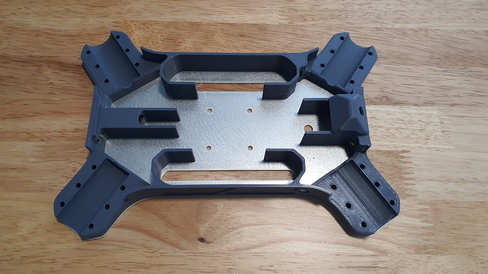<figcaption>
Stacked parts.
</figcaption></figure>

* Prepare the Airframe Bottom and Main body.
* Stack the Main Body on top of the Airframe Bottom.
* Align the parts.

<figure><figcaption>
Antenna Hole.
</figcaption></figure>

<figure><figcaption>
Correct direction of Airframe Bottom alignment.
</figcaption></figure>

 

<figure><figcaption>
Incorrect direction of Airframe Bottom alignment.
</figcaption></figure>

* Ensure the antenna mount hole is facing the correct side.
* Turn the stack upright to check that the hole is facing the XT-90 Mount side and NOT the FPV Camera Mount side.

## Step 2: Arm Bracket Assembly

<figure>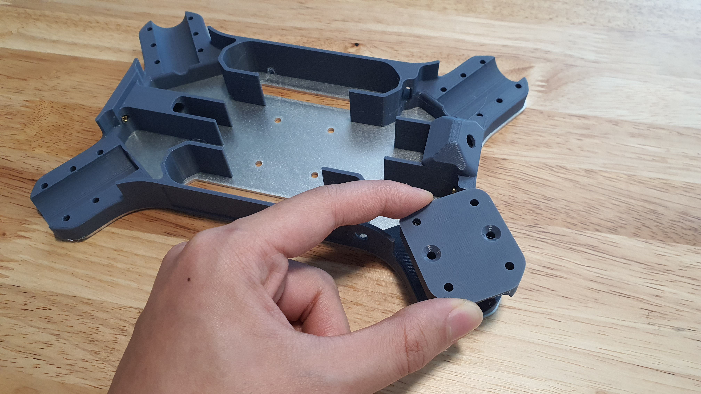<figcaption>
Aligning Arm Bracker to Airframe Stack.
</figcaption></figure>

* Prepare (1x) Arm Bracket, Airframe Stack, (2x) M3x30mm Flat Head Screws, (2x) M3 Washer, and (2x) M3 Nylon Lock Nut.
* Align the Arm Bracket to one of the four corners of the Airframe Stack.

<figure><figcaption></figcaption></figure>

 

<figure><figcaption></figcaption></figure>

* Insert the M3x30mm Flat Head Screw into the chamfered holes on the Arm Bracket.
* Ensure the screws are inserted into the center hole of the row of three holes.
* Align the full stack of parts until the screw ends exit the Airframe Bottom plate.

<figure><figcaption>
Screw ends exiting out Airframe Bottom.
</figcaption></figure>

## Step 3: Landing Gear Assembly

<figure><figcaption>
Aligning Landing Gear to the screw ends.
</figcaption></figure>

 

<figure>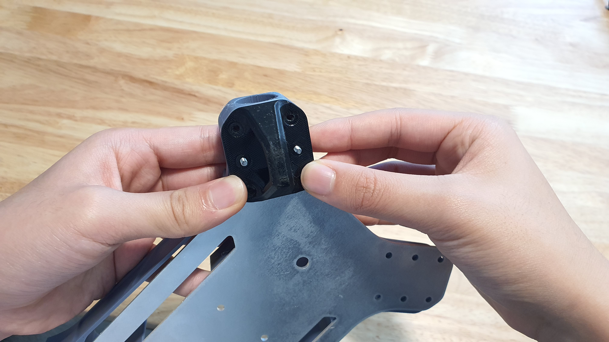<figcaption>
Inserting Landing Gear into screw ends.
</figcaption></figure>

* Prepare the (1x) Landing Gear.
* Align the center holes on the Landing Gear to the&#x20;

## Step 4: Fastening Arm Bracket

<figure><figcaption>
Inserting first M3 Washer.
</figcaption></figure>

 

<figure><figcaption>
Inserting second M3 Washer.
</figcaption></figure>

* Prepare (2x) M3 Washer and (2x) M3 Nylon Lock Nut.
* Insert M3 Washers into each screw end on the bottom of the assembly.

<figure>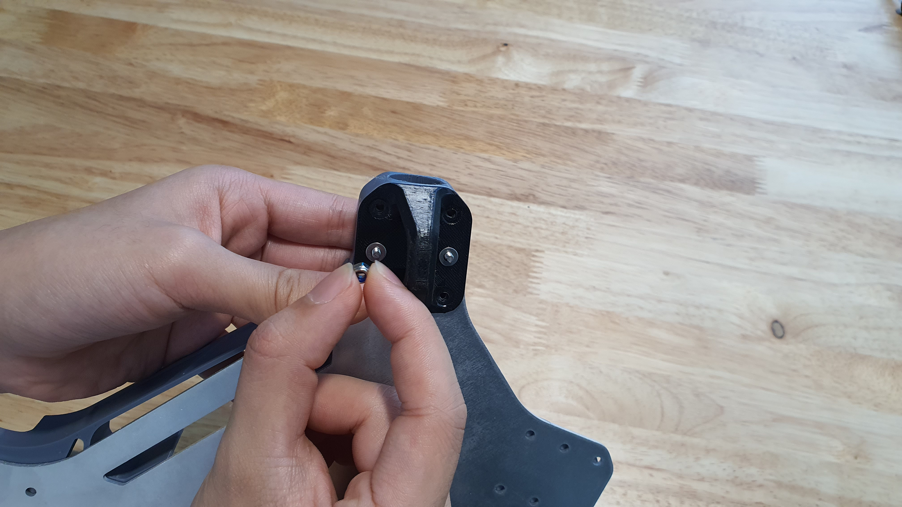<figcaption>
Inserting first M3 Lock Nut.
</figcaption></figure>

 

<figure><figcaption>
Inserting second M3 Lock Nut.
</figcaption></figure>

* Loosely screw in the M3 Nylon Lock Nut


**LOOSELY** screw in the nut, do not tighten. The nuts will be tightened in a later step.


<figure><figcaption>
Completed assembly.
</figcaption></figure>

 

<figure>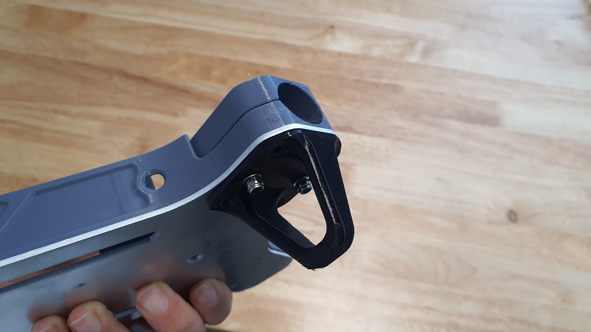<figcaption>
Completed assembly side view.
</figcaption></figure>

## Step 5: Repeat

* Repeat Steps 1-4 for the remaining three corners.

<figure>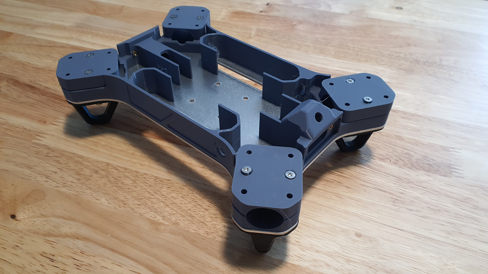<figcaption>
All four Arm Brackets and Landing Gear installed to the airframe.
</figcaption></figure>

## Step 6: Arm Installation

<figure>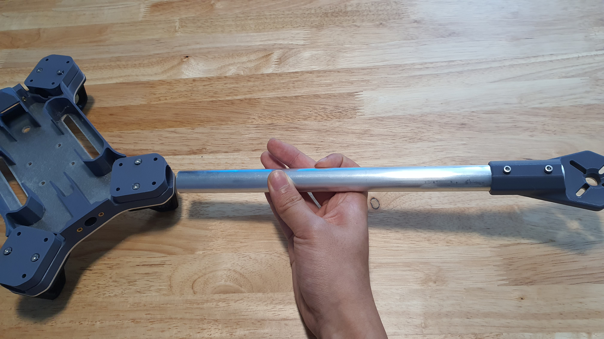<figcaption>
Inserting Arm Assembly into Arm Bracket.
</figcaption></figure>

 

<figure>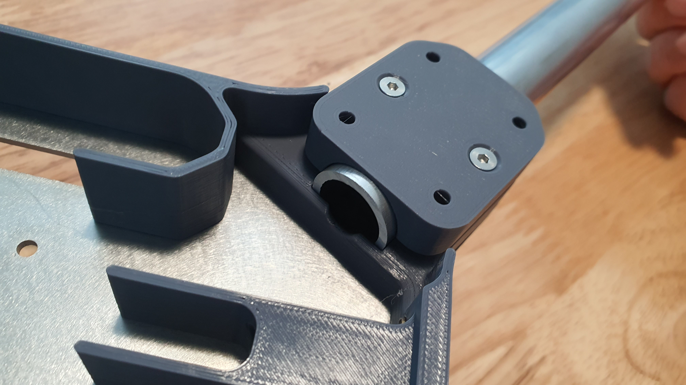<figcaption>
Arm Tube flushly seated into Arm Bracket.
</figcaption></figure>

* Prepare (4x) Arm Assemblies.
* Insert one Arm Assembly into the hole of the Arm Bracket on one of the corners.
* Ensure the Arm Tube is seated all the way.

<figure>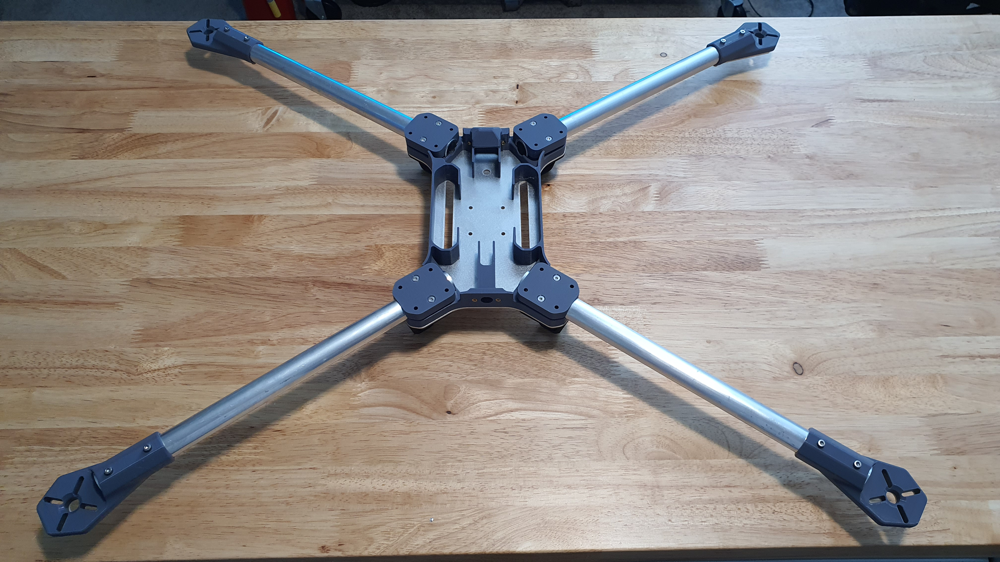<figcaption>
All four Arm Assemblies seated into airframe.
</figcaption></figure>

* Repeat for the remaining three arms.

## Step 7: Arm Alignment

<figure><figcaption>
Arm Alignment Tool pre installation.
</figcaption></figure>

 

<figure>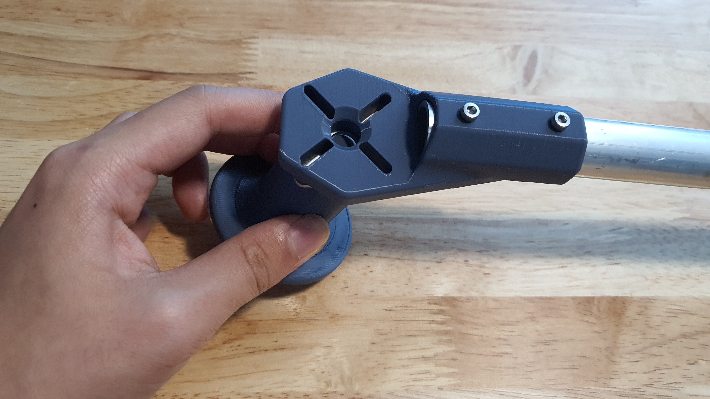<figcaption>
Arm Alignment Tool installation.
</figcaption></figure>

* Prepare (4x) Arm Alignment Tools.
* Insert the Arm Alignment Tool peg into the holes in each Motor Mount.&#x20;

<figure><figcaption>
Proper Alignment Tool setup.
</figcaption></figure>

 

<figure><figcaption>
Properly seated Arm Tube.
</figcaption></figure>

* Ensure the Alignment Tool peg is in all the way, and the bottom of the Alignment Tool is flush against a flat level surface.&#x20;
* Check that the Arm Tube is seated all the way into the Arm Bracket one final time.

<figure><figcaption>
All four arms seated with Arm Alignment Tools in place.
</figcaption></figure>

* Repeat for the remaining three arms.


Ensure that all four Alignment Tools are flush against a smooth and level table surface to ensure proper arm alignment.


## Step 8: Final Arm Installation

<figure><figcaption>
Grabbing the Nylon Lock Nut.
</figcaption></figure>

 

<figure><figcaption>
Carefully tightening the screw.
</figcaption></figure>

* Prepare the 2 mm hex screwdriver and Pliers.
* Grab one of the Nylon Lock Nut underneath the airframe with the pliers.
* Use the 2mm hex screwdriver to tighten the screw carefully.
* Gradually tighten the screw until light resistance is felt.
* Once light resistance is felt, repeat the process for the closest adjacent screw.
* Repeat this process back and forth until hand tight.


It is critical that you alternate tightening between both pair of screws. Hand tighten only to prevent damage to the arm bracket!


<figure><figcaption>
Example of a proper Arm Bracket gap.
</figcaption></figure>

* Ensure that the Arm Bracket gap is even as pictured above.&#x20;
* If the gap is uneven, carefully loosen both sides and try to tighten both sides evenly by alternating tightening between each pair of screws.
* Repeat this step for the remaining three Arm Bracket Assemblies.

## Step 9: Final Prep

<figure><figcaption></figcaption></figure>

* Proceed with a final check to ensure all the arms have been installed level.
* Gently twist each arm to ensure that the screws are properly tightened.
* If any movement is present during the twist test, repeat Step 8 for that arm.
* Once everything is checked and ready, remove the Arm Alignment Tool.

## Step 10: Section 3 Finished


Congratulations! You are now ready to move onto Section 4.&#x20;

