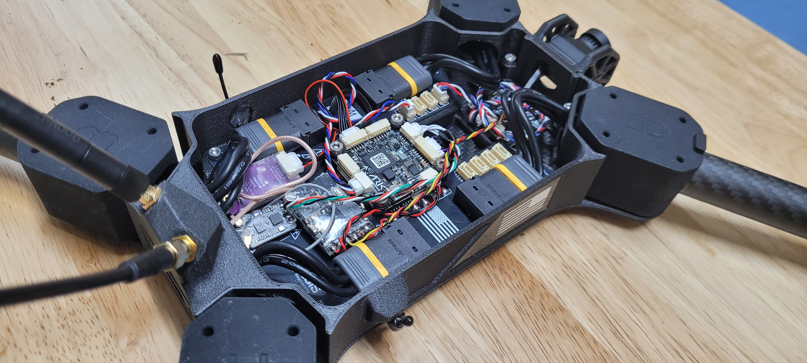

# 2. Electronics Installation

## Parts for this section

* (1x) Drone Body
* (1x) Drone Body Top
* (1x) Digital VTX Mount

Ensure you have sourced the following parts (not included in the kit):

* RC Radio system of your choice
* FPV Video system of your choice

## Step 1: VTX & Electronics Mounting Tips



## Electronics Mounting Reference:

### Electronics Mounting Area:

<figure><figcaption></figcaption></figure>

### Example Build Out

<figure><figcaption></figcaption></figure>

The above example is a fully decked-out FPV build-out with a VTX, SIK radio, and RC Receiver.&#x20;

## General Wiring Guide

