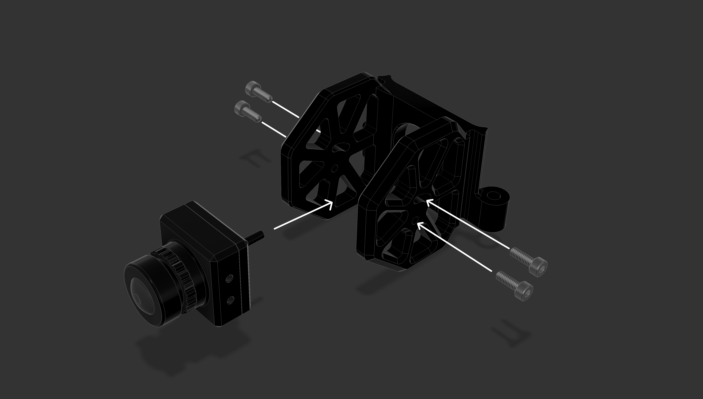

# 3. FPV Camera Mount

## Parts for this section

* (2x) M3x12 Socket Head Cap Screws
* (1x) FPV Camera Mount

Ensure you have sourced the following parts (not included in the kit):

* (1x) FPV camera from the FPV Video system of your choice

## Step 1: FPV Camera Mount Installation



## Step 2: Mounting FPV Camera

<figure><figcaption></figcaption></figure>


ou are ready to move on to Section 4.

