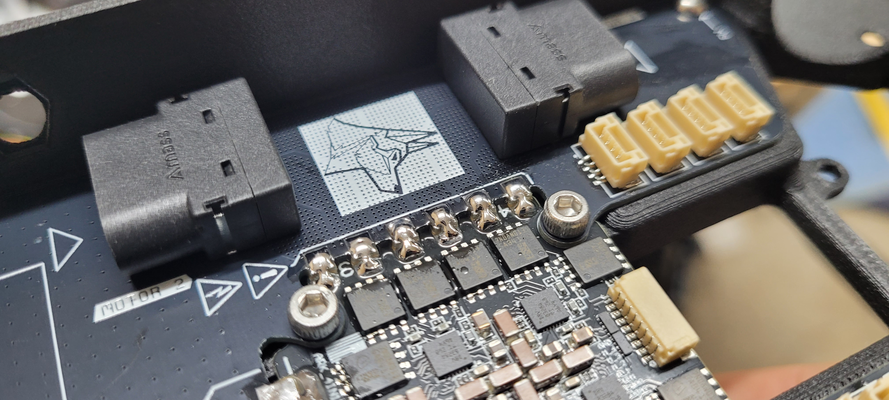

# 4. PCB & Electronics Stack Insallation

## Tools for this section

* Black Allen Key
* Soldering Iron
* Solder Flux
* Solder

## Parts for this section

* (1x) Genesis PD Board
* (4x) M3x14 Socket Head Cap Screws
* (4x) Vibration Isolator

Ensure you have sourced the following parts (not included in the kit):

* (1x) ARK 4 in 1 ESC
* (1x) ARK FPV FC

## Step 1: ARK 4 in 1 ESC & PD Board Installation



## Step 2: Soldering



## Step 3: Checking


Ensure that the solder joints are. Check that the solder joint:

* Have a consistent shiny surface
* The pads on both components are evenly covered with solder
* Solder is pooled within the joints
* Have a round liquid puddled shape
* There is no bridging
* There is no splatter or droplets near the joint that could interfere with the components on the ESC
* There is no excess solder pooling off the joint


<figure><figcaption></figcaption></figure>

## Step 4: ARK FPV FC Installation




Let's begin the build!

