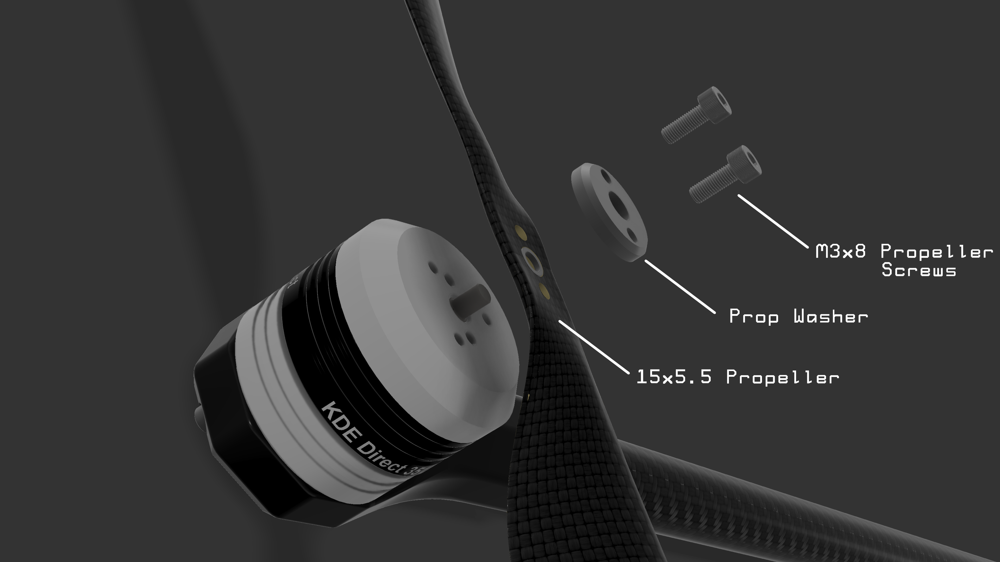

# 5. Propeller Installation


Propeller installation should only be done once the drone is ready to fly. **Never** have the **propellers installed** on the drone while you are **working on the airframe** or **configuring its software.**


## Tools for this section

* Black Allen Key

## Parts for this section

* (4x) Propeller Washer
* (8x) Propeller Screws (m3x8)
* (2x) Clock-Wise 15x5.5 Propeller
* (2x) Counter-Clockwise 15x5.5 Propeller

## Propeller Installation Diagram:

Follow the diagrams below for propeller installation. Ensure that the clockwise and counterclockwise propellers are installed to the correct arms (see propeller orientation diagram). Hand-tighten the screws only, do not use power tools.

### Assembly:

<figure><figcaption></figcaption></figure>

### Propeller Orientation:

<figure><figcaption></figcaption></figure>


* Ensure that the propellers are installed to the correct corresponding arms.
* **HAND TIGHTEN** the propeller screw only, do not use power tools.
* Check that the propellers are securely fastened.&#x20;

