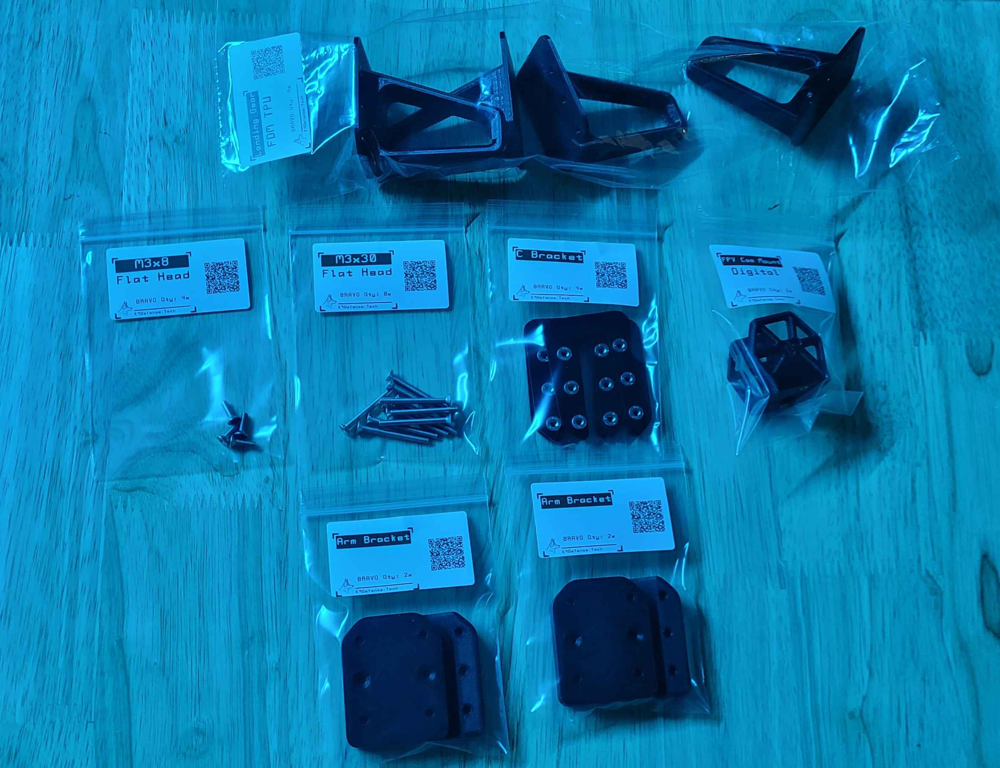

# 2. FPV Cam Mount & Arm Brackets

## Tools for this section

<figure><figcaption></figcaption></figure>

* 2 mm Hex Screwdriver

## Parts for this section

<figure><figcaption></figcaption></figure>

* (1x) Drone Main Body 3D Print
* (1x) FPV Camera Mount
* (1x) FPV Camera (Not included in kit)
* (4x) TPU Landing Gear
* (4x) Arm Brackets
* (4x) C Brackets
* (8x) M3x30 Flat Head Screws
* (2x) M3x8 Flat Head Screws

## Step 1: FPV Camera Mount



## Step 2: Arm Bracket Assembly


To avoid frame damage hand tighten only!





You are ready to move on to Section 3.

