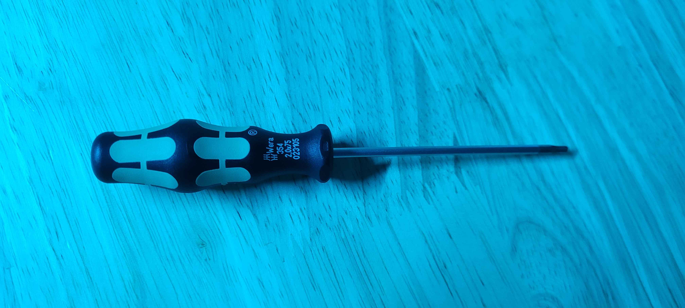
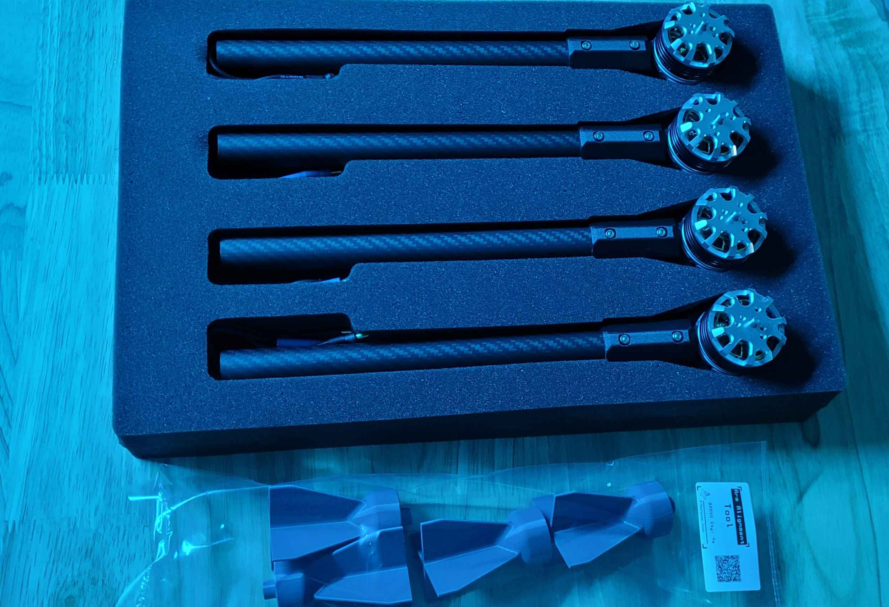

# 3. Arm Integration and Alignment

## Tools for this section

<figure><figcaption></figcaption></figure>

* 2 mm Hex Screwdriver

## Parts for this section

<figure><figcaption></figcaption></figure>

* (4x) Pre-assembled drone arms
* (4x) Arm Alignment Tool

## Step 1: Arm Integration



## Step 2: Arm Alignment




You are ready to move on to Section 4.

