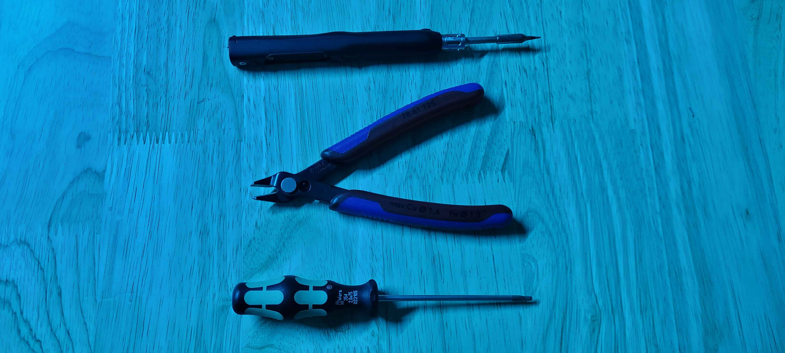
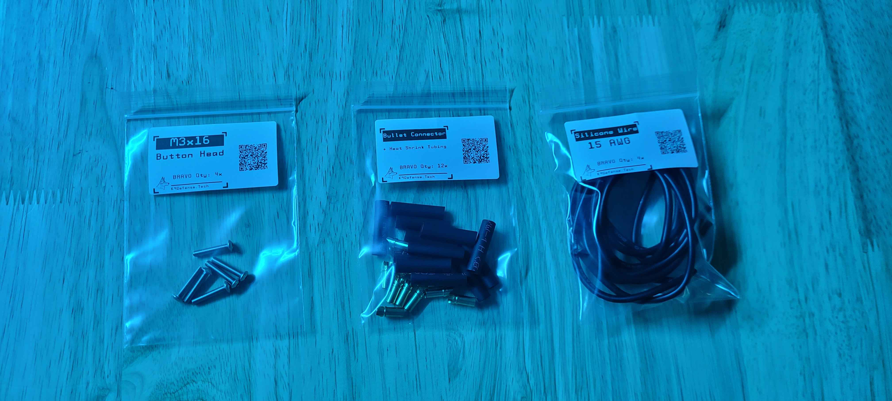

# 4. Electronics

## Tools for this section

<figure><figcaption></figcaption></figure>

* 2 mm Hex Screwdriver
* Soldering Iron
* Wire Snips

## Parts for this section

<figure><figcaption></figcaption></figure>

* 15 AWG Silicone Wire
* (12x) Bullet Connector (female)
* (12x) Heat Shrink Tubing
* (4x) M3x16mm Button Head Screws
* (1x) ARK FPV Flight Controller (Not Included)
* (1x) ARK 4 in 1 ESC (Not Included)
* (1x) FPV VTX (Not Included)
* (1x) RC Receiver (Not Included

## Step 1: Soldering ESC Wires and Mounting Electronics



## Step 2: Proceed with wiring relevant electronics

### Examples of RC Receiver Antenna Mounting

### Examples of Analog VTX Mounting

### ARK FPV Docs



### ARK 4 in 1 ESC Docs




**Double-check all your electronics wiring before proceeding to the next step.**

Check:

* The motor direction is correct.
* Battery lead polarity to ESC is correct.
* All signal wires are correct.
* USB-C extension is plugged into the flight controller.



You are ready to move on to Section 5.

