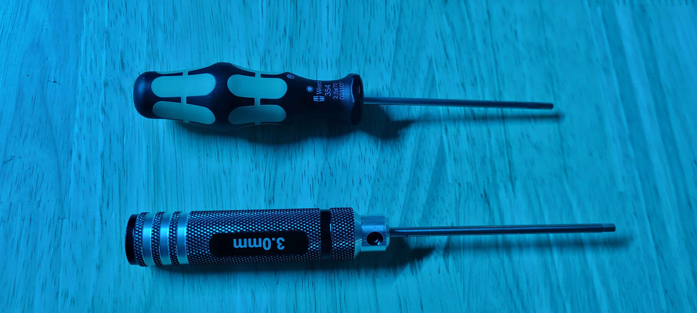
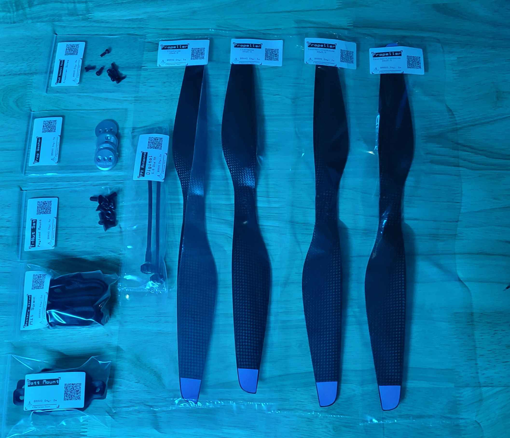

# 6. Battery Mount, Props, & Antenna Installation


As of Jan 2025, this page is stored for archival purposes. Bravo has been replaced with the newer [Bravo 2 ](../../bravo-v2/)design.


## Tools for this section

<figure><figcaption></figcaption></figure>

* 3 mm Hex Screwdriver
* 2.5 mm Hex Screwdriver

## Parts for this section

<figure><figcaption></figcaption></figure>

* (2x) Battery Mount
* (2x) Battery Straps
* (4x) M-Lock T-Nut set
* FPV Antenna (1x for Analog, 2x for Digital)
* (2x) 15x5.5 Clockwise Propeller
* (2x) 15x5.5 Counter-Clockwise Propeller
* (4x) Propeller Washer
* (8x) M3x8 Socket head propeller screw

## Step 1: Battery Mount and Strap Installation



#### Top Mounting Battery:

It includes a Battery Top Mount adapter.

## Step 2: Propeller Installation




Congratulations! You have completed the assembly.

