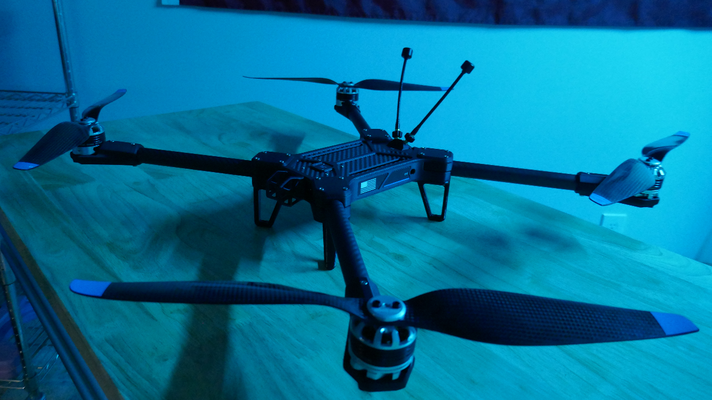

# 3. Arm Integration and Alignment

## Tools for this section:

* h

## Parts for this section:

<figure><figcaption></figcaption></figure>

* g
* g

## Step 1: FPV Camera Mount



## Step 2: Arm Bracket Assembly




You are ready to move on to Section 3.

