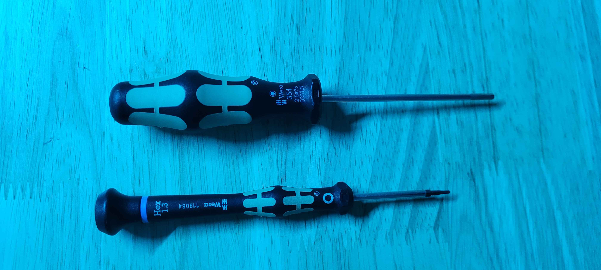

# 5. Final Frame Assembly

## Tools for this section

<figure><figcaption></figcaption></figure>

* 1.3 mm Hex Screwdriver
* 2.5 mm Hex Screwdriver

## Parts for this section

<figure><figcaption></figcaption></figure>

* (1x) Carbon Fiber Airframe Top Plate
* (4x) M2x12 Button Head Screws
* (16x) M3x35 Socket Head Screws
* (2x) GPS Brackets
* (1x) ARK GPS (Not included)

## Step 1: Installing ARK GPS



## Step 2: Closing Up The Airframe




You are ready to move on to Section 6.

