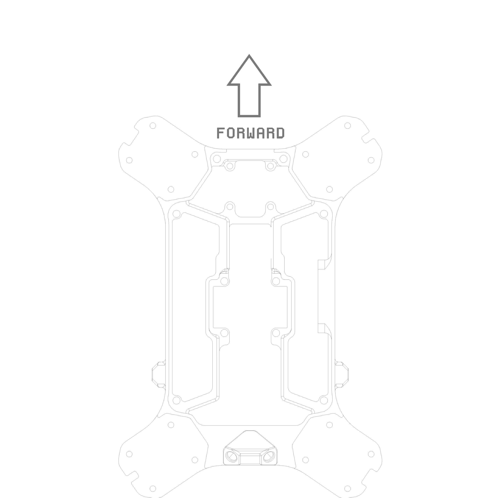
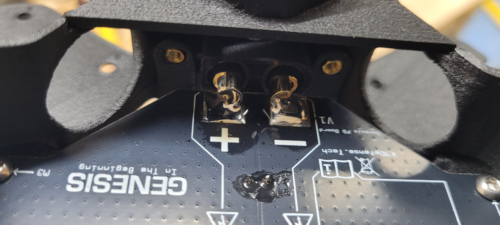

# 2. PD Board Installation

## Tools for this section

* Black Allen Key
* Blue Allen Key
* Soldering Iron
* Solder Flux
* Solder

## Parts for this section

* (1x) Main Airframe Enclosure
* (1x) PD Board with ARK Power Module
* (1x) ARK 4 in 1 ESC
* (1x) XT-90E-M
* (4x) M3x12 Socket Head Cap Screws
* (4x) M3x8 Socket Head Cap Screws
* (2x) M3x8 Flat Head Screws

##

## Step 1: Mounting PD Board




Gently hand-tighten the screws to the PD board only! Overtightening the screws may damage the PCB.


### Main airframe enclosure forward direction reference:


Throughout the manual the "front" and "back of the drone will be referenced. The easiest way to identify the "rear" or "back" of the drone is by the two antenna SMA ports in the back.&#x20;


<figure><figcaption></figcaption></figure>

## Step 2: Mounting ESC & Power Connector



##

## Step 3: Soldering



## Step 4: Checking&#x20;


Ensure that the solder joints are. Check that the solder joint:

* Have a consistent shiny surface
* The pads on both components are evenly covered with solder
* Solder is pooled within the joints
* Have a round liquid puddled shape
* There is no bridging
* There is no splatter or droplets near the joint that could interfere with the components on the ESC
* There is no excess solder pooling off the joint


<figure><figcaption></figcaption></figure>

<figure><figcaption></figcaption></figure>

##


You are ready to move on to Section 3.

