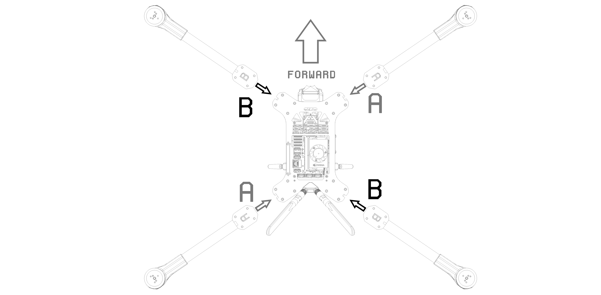

# 4. Final Electronics Wiring & Arm Installation

## Tools for this section

## Parts for this section

* (1x) SIK Radio
* (2x) Adhesive Strips
* (4x) Genesis Motor Arms
* (16x)&#x20;

## Step 1: Final Wiring Prep



##

### General Wiring Guide

<figure><figcaption></figcaption></figure>


This is a reference guide


##

## Step 2: Motor Arm Wiring



### Genesis Arm Installation Diagram

<figure><figcaption></figcaption></figure>

## Step 3: Jetson PAB Installation




Gently hand tighten the screws to the Jetson PAB board only! Overtightening the screws may damage the PCB.


##


You are ready to move onto Section 5.

