# 3D Printed Parts

Genesis is designed to use a variety of FDM printed parts optimized for accessible and economical desktop 3D printers. Ensure that mechanically adequate materials and print settings are selected before printing ([Materials & Print Settings](materials-and-print-settings.md)).

### Main Body

<figure>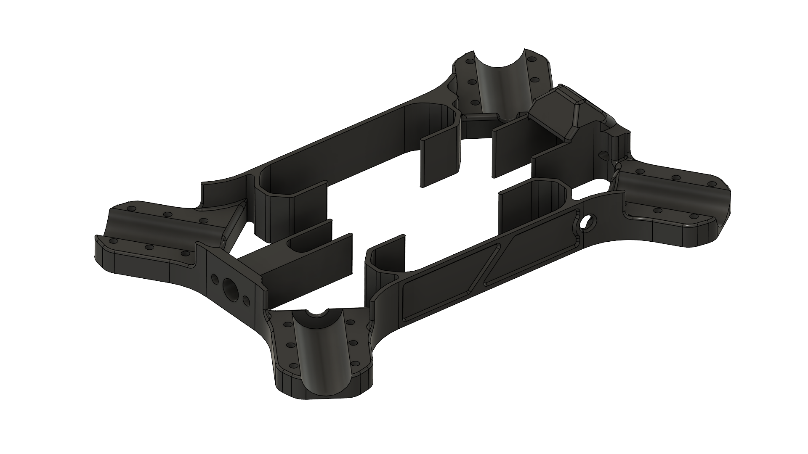<figcaption></figcaption></figure>

#### Recommended Print Orientation:

<figure><figcaption></figcaption></figure>

#### Recommended Supports:

<figure><figcaption></figcaption></figure>

 

<figure><figcaption></figcaption></figure>


For a Digital FPV build, do not print this file. Print the modified main body [**here**](genesis-digital-fpv-main-body.md).




### Top Plate

<figure>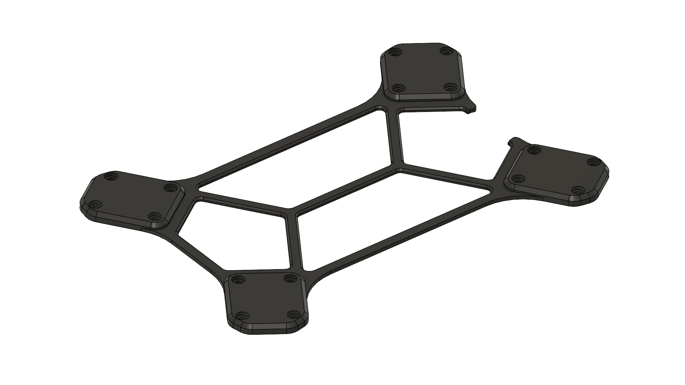<figcaption></figcaption></figure>

#### Recommended Print Orientation:

<figure><figcaption></figcaption></figure>


No supports are needed.




###

### Arm Bracket

<figure>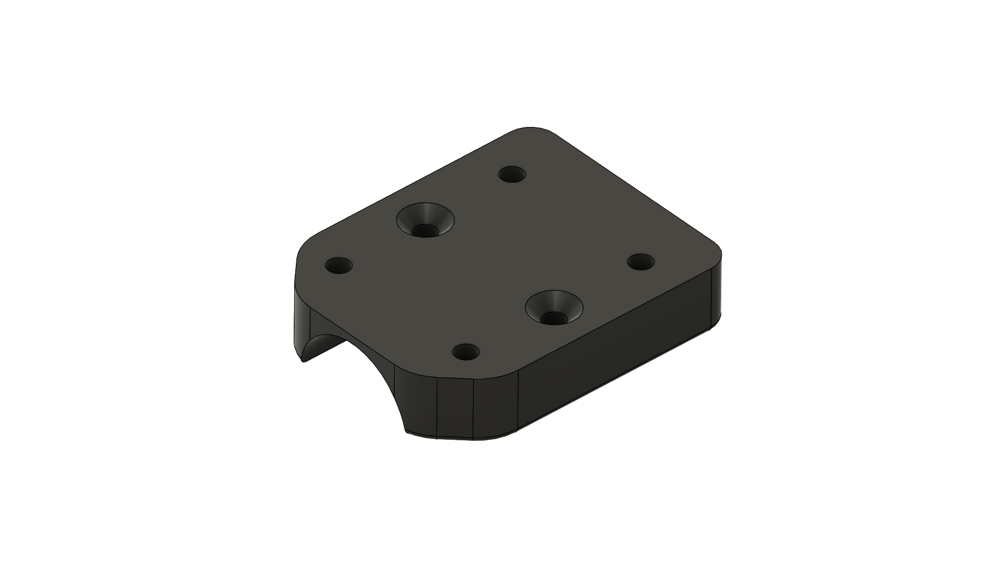<figcaption></figcaption></figure>

#### Recommend Print Orientation:

<figure><figcaption></figcaption></figure>


No supports are needed. Ensure 4 brackets are printed.




###

### Motor Mount

<figure>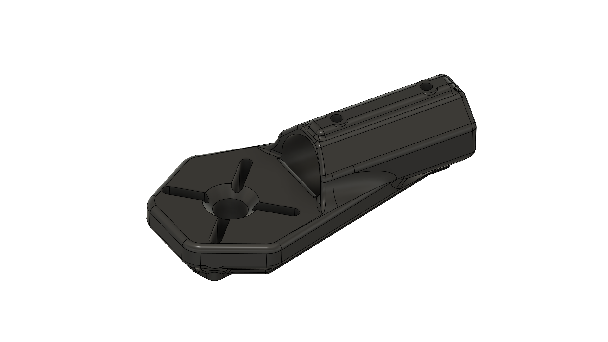<figcaption></figcaption></figure>

#### Recommend Print Orientation:

<figure><figcaption></figcaption></figure>

#### Recommended Supports:

<figure><figcaption></figcaption></figure>


Ensure 4 brackets are printed.&#x20;




###

### Landing Gear

<figure><figcaption></figcaption></figure>

#### Recommended Print Orientation:

<figure>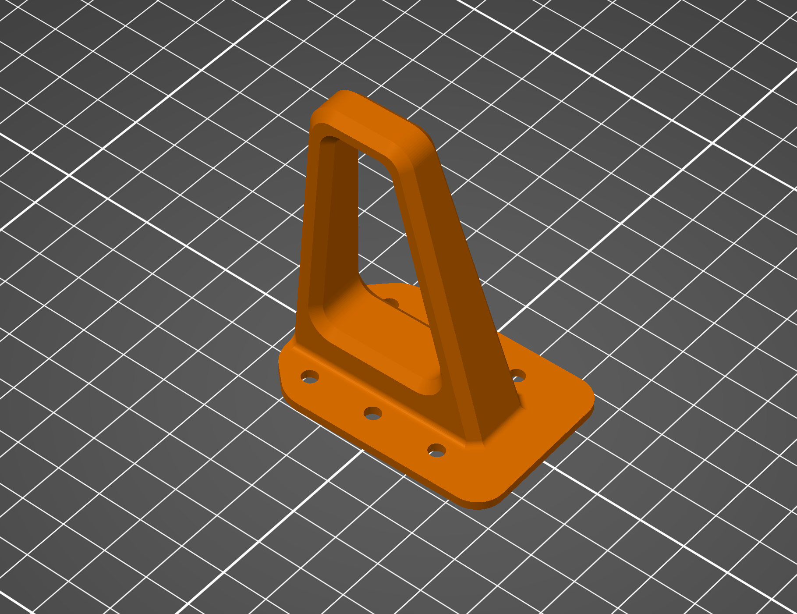<figcaption></figcaption></figure>


No supports are needed. Ensure 4 brackets are printed. Make sure to print using flexible material like TPU.




###

### FPV Camera Mount

<figure>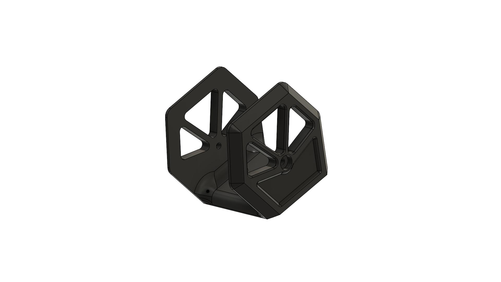<figcaption></figcaption></figure>

#### Recommend Print Orientation:

<figure><figcaption></figcaption></figure>



### Battery Mount

<figure>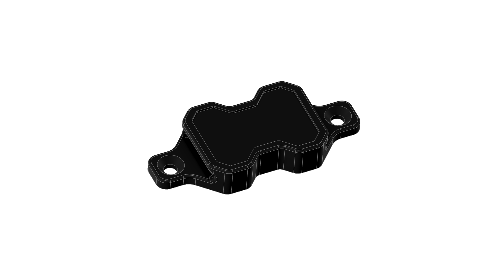<figcaption></figcaption></figure>

#### Recommended Print Orientation:

<figure>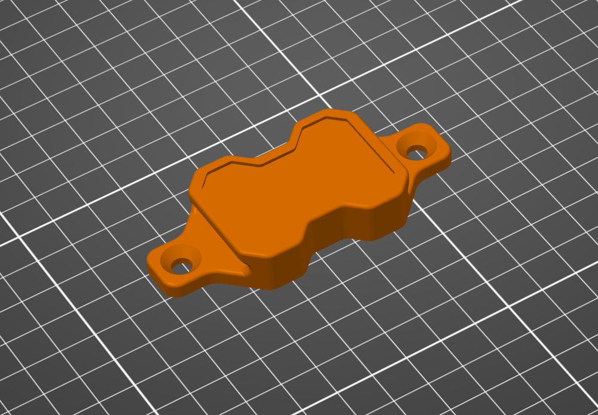<figcaption></figcaption></figure>

#### Recommended Supports:

<figure>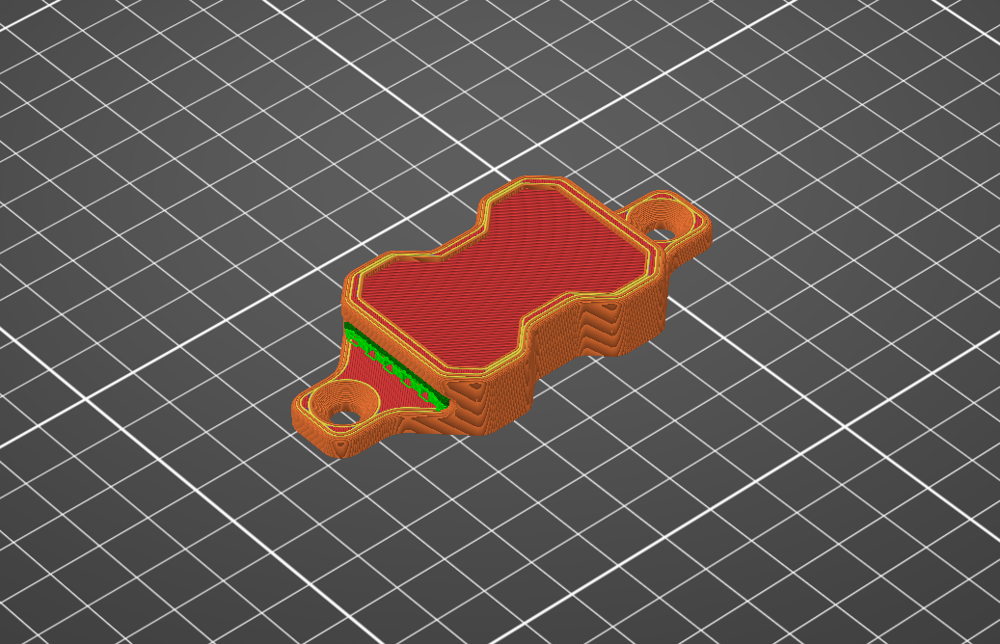<figcaption></figcaption></figure>


Ensure 2 battery mounts are printed. Ensure to use 100% infill.




### Rubber Stencil Tool

<figure>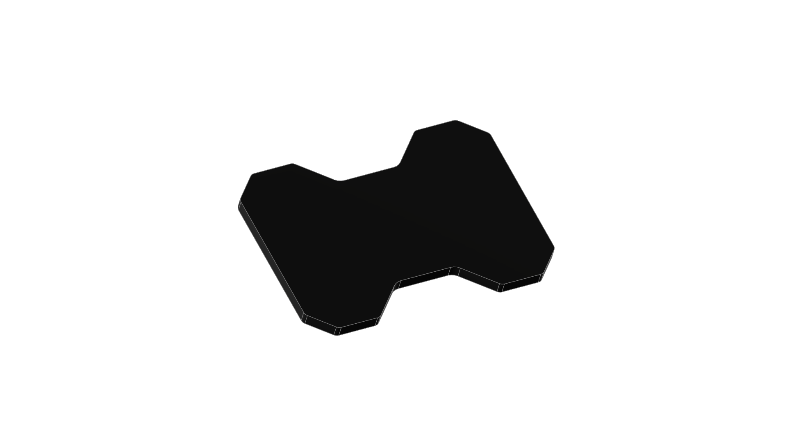<figcaption></figcaption></figure>

#### Recommended Print Orientation

<figure>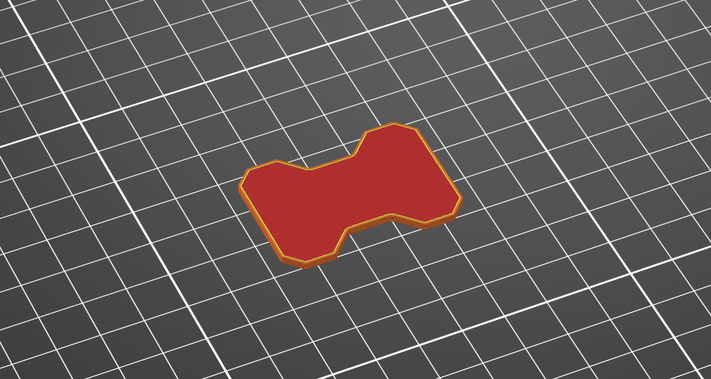<figcaption></figcaption></figure>


No supports are needed.




### Arm Alignment Tool

<figure>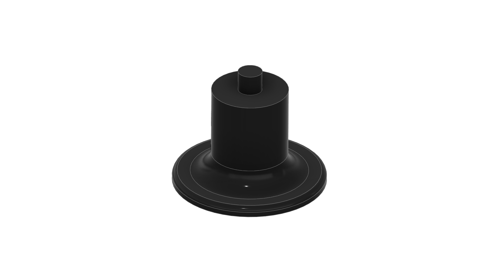<figcaption></figcaption></figure>

#### Recommended Print Orientation:

<figure><figcaption></figcaption></figure>


No supports are needed. Ensure 4 Aligners are printed.




##

## Printed Parts Checklist

| Part                | Quantity | Material       | Support | Recommended Infill |
| ------------------- | -------- | -------------- | ------- | ------------------ |
| Main Body           | 1x       | PLA, ASA, PETG | Yes     | 15-60%             |
| Top Plate           | 1x       | PLA, ASA, PETG | No      | 15-25%             |
| Arm Bracket         | 4x       | PLA, ASA, PETG | No      | 25-70%             |
| Motor Mount         | 4x       | PLA, ASA, PETG | Yes     | 25-70%             |
| Landing Gear        | 4x       | TPU, FLEX      | No      | 15%                |
| FPV Camera Mount    | 1x       | PLA, ASA, PETG | No      | 70%                |
| Battery Mount       | 2x       | PLA, ASA, PETG | No      | 70%                |
| Rubber Stencil Tool | 1x       | PLA, ASA, PETG | No      | 15-100%            |
| Arm Alignment Tool  | 4x       | PLA            | No      | 15%                |

