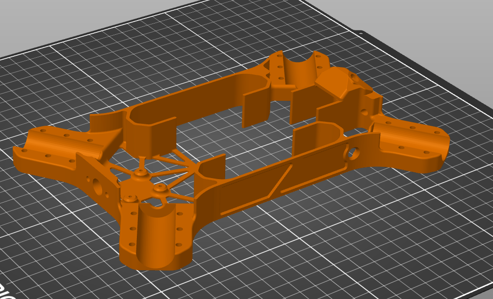

# Genesis Digital FPV Main Body

The Digital FPV configuration is identical except for the main body and camera mount print. The Digital FPV configuration main body hosts a dual antenna mount and a 20mm x 20mm mounting hole for the digital FPV VTX. The Digital FPV build is for advanced builders, the default Analog FPV configuration for Genesis is recommended for beginners.&#x20;

<figure><figcaption></figcaption></figure>

## Main Body (Digital FPV Mod)

<figure><figcaption></figcaption></figure>

### Recommended Print Orientation:

<figure><figcaption></figcaption></figure>

### Recommended Supports:

<figure><figcaption></figcaption></figure>

 

<figure><figcaption></figcaption></figure>



## FPV Camera Mount (Digital FPV Mod)

<figure><figcaption></figcaption></figure>

### Recommended Print Orientation:

<figure><figcaption></figcaption></figure>

### Recommended Supports:

<figure><figcaption></figcaption></figure>


