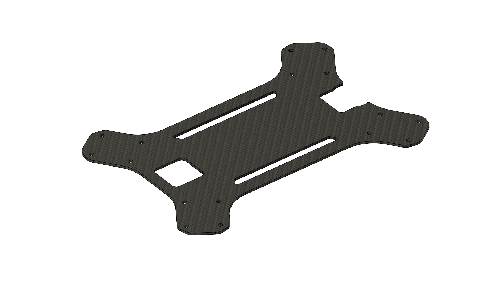

# Sheet Parts


As of April 2025, this page is stored for archival purposes. K9 has replaced the Genesis drone family to the newly improved Genesis Bravo 3.


Genesis uses a sheet material airframe structure to form a strong rigid sandwich airframe structure that is easy to mass produce economically and quickly. The airframe can be made out of either aluminum or carbon fiber, allowing the user to choose between durability or performance.

## Selecting Material

<table><thead><tr><th>Material</th><th data-type="rating" data-max="5">Weight</th><th data-type="rating" data-max="5">Strength</th><th data-type="rating" data-max="5">Durability</th></tr></thead><tbody><tr><td>5052-H32 Alumnium (2mm)</td><td>4</td><td>3</td><td>5</td></tr><tr><td>Twill Weave Carbon Fiber (2mm)</td><td>2</td><td>4</td><td>2</td></tr></tbody></table>

##

## Sheet Part List

### Airframe Top

<figure><figcaption></figcaption></figure>





###

### Airframe Bottom

<figure><figcaption></figcaption></figure>





###

### Motor Thrust Plate

<figure><figcaption></figcaption></figure>


Ensure to cut 4 thrust plates.






##

## Recommended Cut Service

### Aluminum:&#x20;

Fast, affordable, and precise, RMFG is our go-to service for aluminum components.



### Carbon Fiber:

CNC Madness is a well-known and reputable carbon fiber cut service popular with drone hobbyists.&#x20;



