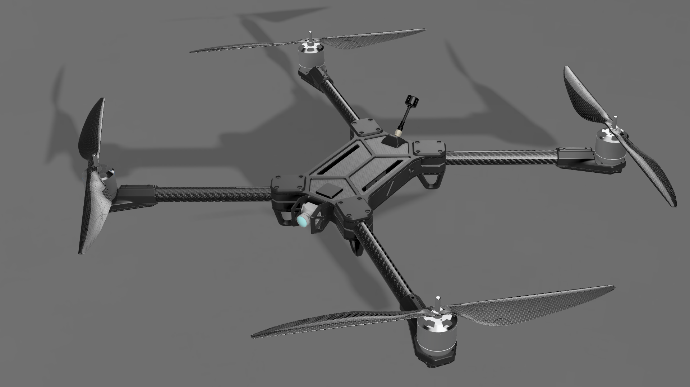
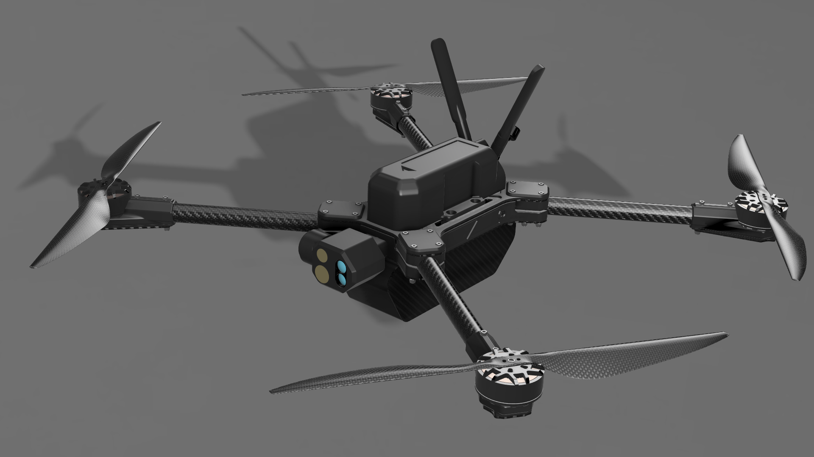

# Choose Genesis Models

The Genesis drone family comes in three variants. Select the variant that matches your application or mission set below.

## Genesis-A

<figure><figcaption></figcaption></figure>

The A Model is the most economical, manufacturable, and accessible variant of Genesis. Genesis A is easy to build with very few tools or resources and it is parts agnostic, allowing the user to select and source various motors, flight controllers, and more. Genesis-A is designed to be simple and reliable.


Genesis-A is the most economical option and is recommended for most builders.


### Links:

#### [Genesis-A Docs](../genesis-a/part-chooser/)&#x20;

#### Buy Kits

## Genesis-B (NDAA Compliant)

<figure><figcaption></figcaption></figure>

The B Model for both civilian and defense professionals, with more smarter feature. Genesis-B is powered by

## Genesis-C (NDAA Compliant, Munition)

<figure><figcaption></figcaption></figure>

The C Model is designed for terminal guidance applications, tactical ISR, and other multi-mission roles. Genesis C is in active development for government customers. Genesis-C is only available for government and military customers. For procurement or development details, please reach out to us.&#x20;

### Links:

#### Contacts
