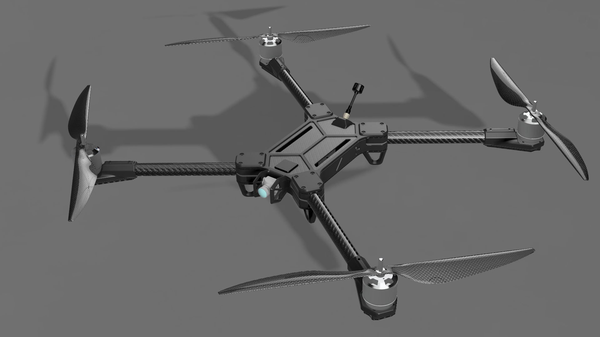
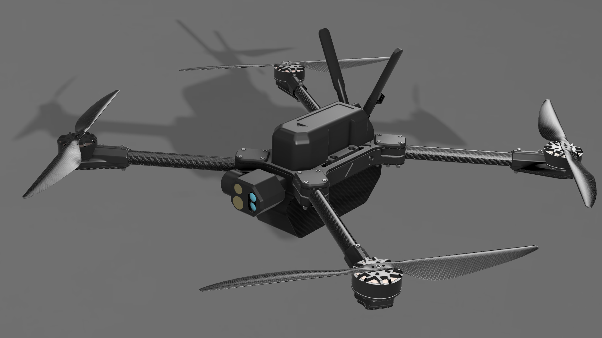

# Choose Genesis Variants

The Genesis drone family comes in three variants. Select the variant that matches your application or mission set below.

## Genesis

<figure><figcaption></figcaption></figure>

Genesis is the most economical, manufacturable, and accessible variant of aimed for beginner drone builders. Genesis is easy to build with very few tools or resources required. Being electronics agnostic, users can select and source various motors, flight controllers, and more from a diverse range of suppliers. Genesis is designed to be simple, reliable, and accessible.


Genesis is the most economical option and is recommended for most builders.


### Links:

#### [Genesis Docs](../genesis/part-chooser/)&#x20;

#### Buy Kits

## Genesis-Bravo (NDAA Compliant)

<figure><figcaption></figcaption></figure>

The Bravo model is for both civilian and defense professionals, with more smarter feature. Genesis-B is powered by

## Genesis-M (NDAA Compliant, Munition)

<figure><figcaption></figcaption></figure>

The Genesis-M is designed for terminal guidance applications, tactical ISR, and other multi-mission roles. Genesis-M is in active developing for government customers. Genesis-M is only available for government and military customers. For procurement or development details, please reach out to us.&#x20;

### Links:

#### Contact Us
