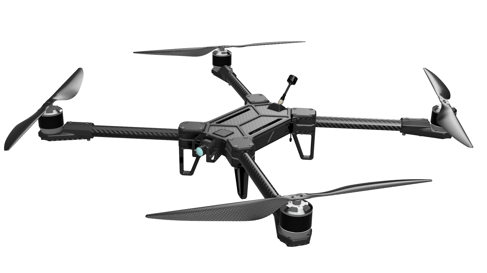
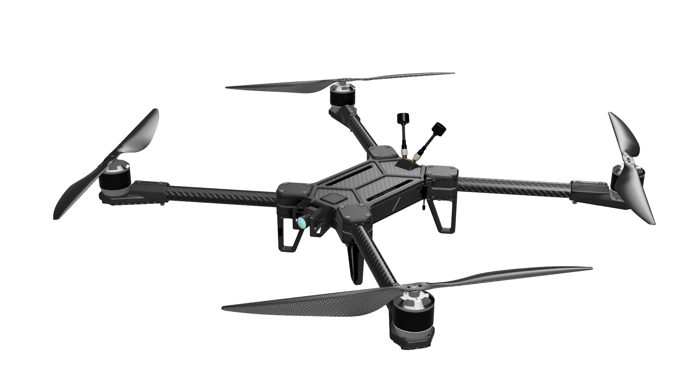
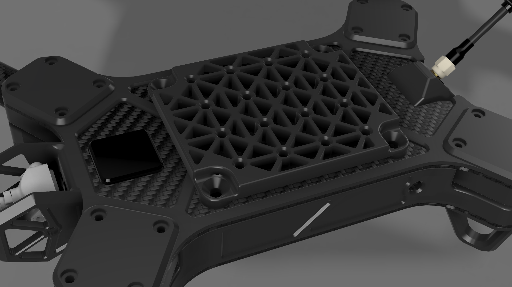
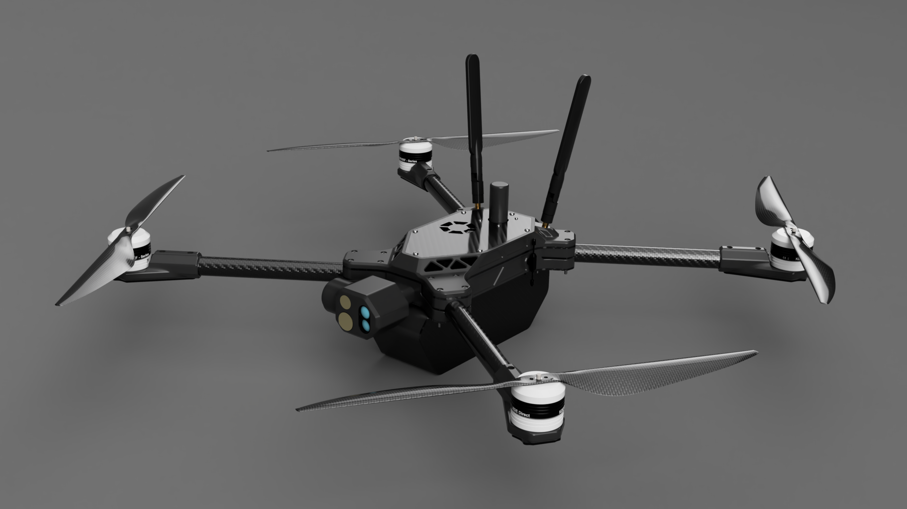

# Configurations

Genesis&#x20;

## Analog FPV (Default)

<figure><figcaption></figcaption></figure>

**Compatible Models**: Genesis, Genesis-Bravo, Genesis-Delta

FPV or First Person View, allows

## Digital FPV

<figure><figcaption></figcaption></figure>

**Compatible Models:** Genesis, Genesis-Bravo, Genesis-Delta

## R\&D

<figure><figcaption></figcaption></figure>

**Compatible Models:** Genesis, Genesis-Bravo, Genesis-Delta

k

## Edge AI

<figure><figcaption></figcaption></figure>

## ISR

Coming soon.

**Compatible Models:** Genesis-Bravo, Genesis-M

## Terminal Guidance

<figure><figcaption></figcaption></figure>

**Compatible Models:**  Genesis-M

Only available on Genesis-M for government customers. More details will be available soon. Contact us here.
