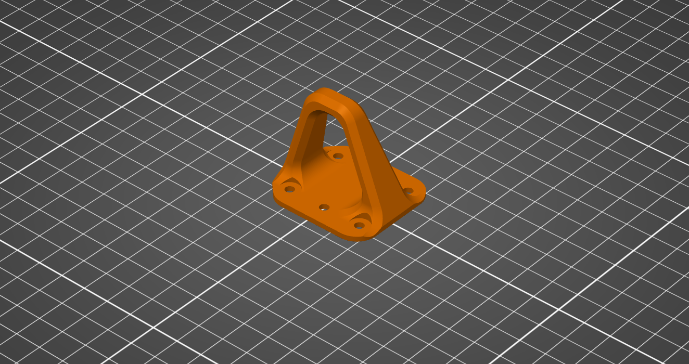

# 3D Printed Parts

Genesis is designed to use a variety of FDM printed parts optimized for accessible and economical desktop 3D printers. Ensure that mechanically adequate materials and print settings are selected before printing ([Materials & Print Settings](materials-and-print-settings.md)).

## Printed Parts List

### Main Body

<figure><figcaption></figcaption></figure>

#### Recommend Print Orientation:

<figure><figcaption></figcaption></figure>

#### Recommend Supports:

<figure><figcaption></figcaption></figure>

 

<figure><figcaption></figcaption></figure>



### Top Plate

<figure><figcaption></figcaption></figure>

#### Recommend Print Orientation:

<figure><figcaption></figcaption></figure>


No supports are needed.




### Arm Bracket

<figure><figcaption></figcaption></figure>

#### Recommend Print Orientation:

<figure><figcaption></figcaption></figure>


No supports are needed. Ensure 4 brackets are printed.




### Motor Mount

<figure><figcaption></figcaption></figure>

#### Recommend Print Orientation:

<figure><figcaption></figcaption></figure>

#### Recommend Print Orientation:

<figure><figcaption></figcaption></figure>


Ensure 4 brackets are printed.&#x20;




### Landing Gear

<figure><figcaption></figcaption></figure>

#### Recommend Print Orientation:

<figure><figcaption></figcaption></figure>


No supports are needed. Ensure 4 brackets are printed. Make sure to print using flexible material like TPU.




### FPV Camera Mount

<figure><figcaption></figcaption></figure>

#### Recommend Print Orientation:

<figure><figcaption></figcaption></figure>



## Printed Parts Checklist

| Part             | Quantity | Material       | Support |
| ---------------- | -------- | -------------- | ------- |
| Main Body        | 1x       | PLA, ASA, PETG | Yes     |
| Top Plate        | 1x       | PLA, ASA, PETG | No      |
| Arm Bracket      | 4x       | PLA, ASA, PETG | No      |
| Motor Mount      | 4x       | PLA, ASA, PETG | Yes     |
| Landing Gear     | 4x       | TPU, FLEX      | No      |
| FPV Camera Mount | 1x       | PLA, ASA, PETG | No      |
