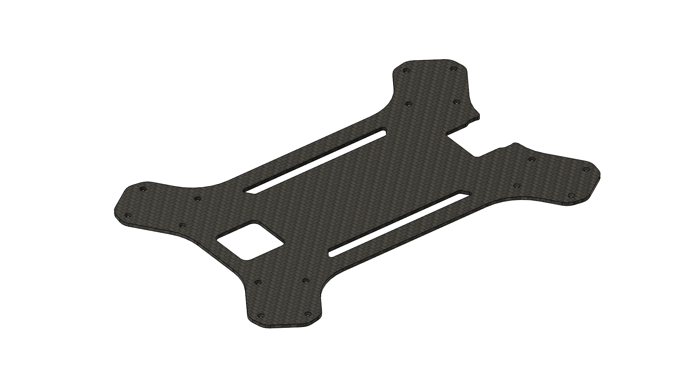

# CNC Parts

## Selecting Material

<table><thead><tr><th>Material</th><th data-type="rating" data-max="5">Weight</th><th data-type="rating" data-max="5">Strength</th><th data-type="rating" data-max="5">Durability</th></tr></thead><tbody><tr><td>5052-H32 Alumnium (2mm)</td><td>4</td><td>3</td><td>5</td></tr><tr><td>3mm Twill Weave Carbon Fiber</td><td>2</td><td>4</td><td>1</td></tr></tbody></table>

## Sheet Part List

<figure><figcaption></figcaption></figure>

## Recommended Cut Service

### Aluminum:&#x20;

Fast, affordable, and precise, RMFG is our go-to service for aluminum components.



### Carbon Fiber:

CNC Madness is a well-known and reputable carbon fiber cut service popular with drone hobbyists.&#x20;



