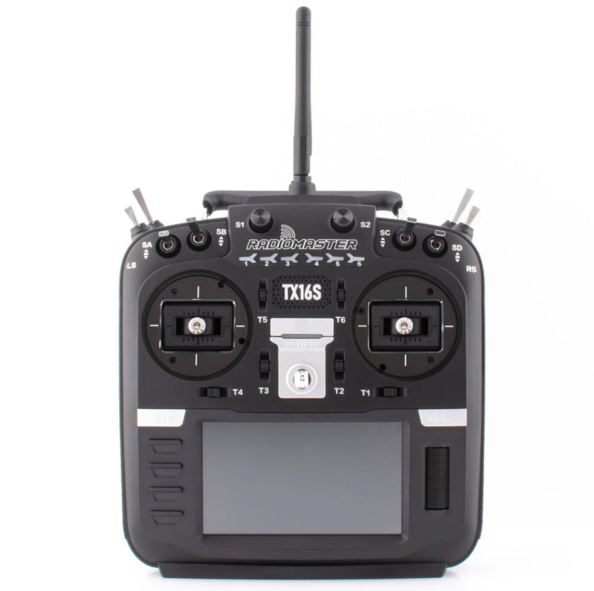

# Radio & RC Receiver

The Radio and Receiver is what allows the control signals to be wireless sent to the drone. I=

## ELRS

We highly recommend ELRS, an open-source drone radio control link ecosystem. ELRS offers cross-compatibility between different hardware manufacturers and frequent firmware upgrades for new software-defined feature upgrades. \

Learn more:



## Radio Reciever (drone side)

### Reccomended Option

Diverity allows the RX to switch to the optimal antenna in real-time. Genesis is designed to hold 2 RX antennas for maximum performance.

<figure><figcaption></figcaption></figure>



## Radio Transmitter

### Recommended Budget Option

The RadioMaster Pocket is a great beginner radio for getting started into drones.

<figure><figcaption></figcaption></figure>




Ensure the ELRS version is selected.


### Recommended Option

k

<figure><figcaption></figcaption></figure>

k



## Choosing Alternatives


